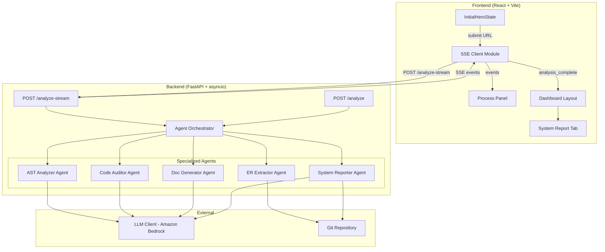
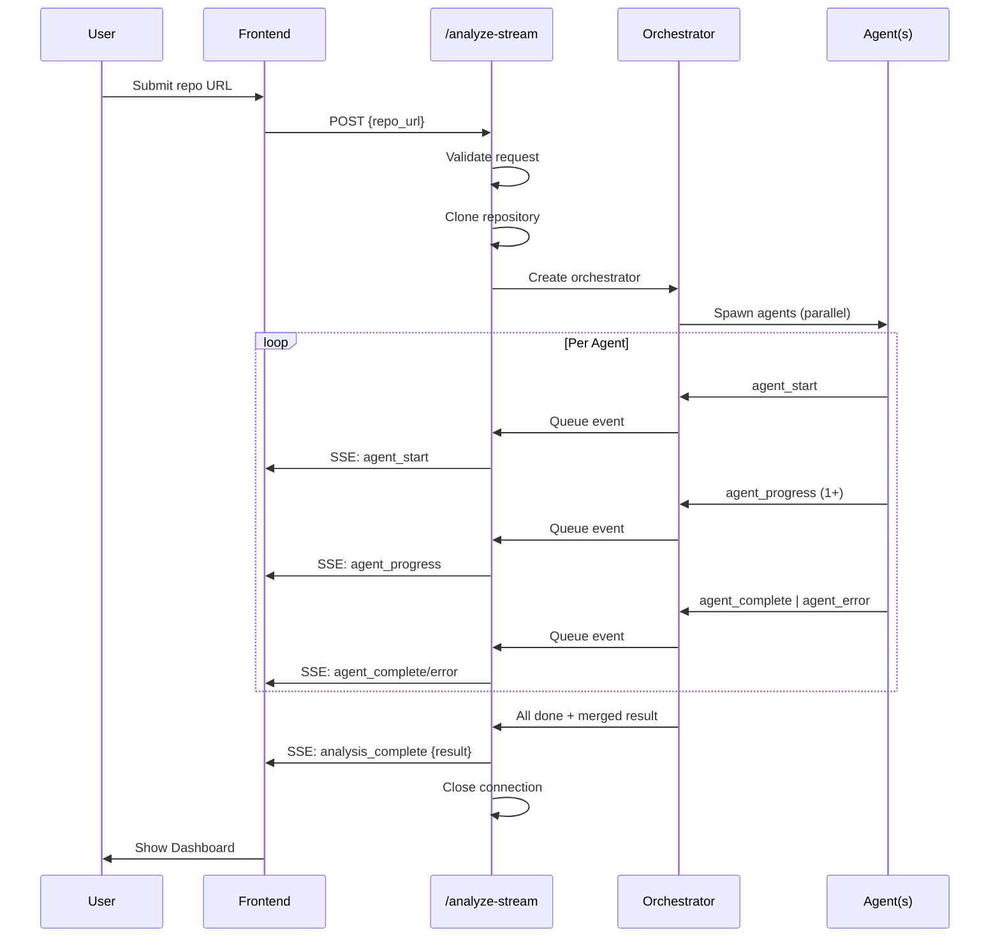

# Design Document: Agent Streaming & Reporting

## Overview

This design transforms DevGhost Parser from a monolithic synchronous analysis system into a multi-agent architecture with real-time streaming. The backend orchestrates five specialized AI agents running in parallel via `asyncio`, while the frontend consumes Server-Sent Events (SSE) to display live agent activity. A new System Report agent detects technology stacks and generates setup instructions, surfaced through a dedicated dashboard tab.

**Key Design Decisions:**
- **asyncio.TaskGroup** over raw `gather` for structured concurrency and automatic cancellation propagation
- **SSE via FastAPI StreamingResponse** rather than WebSockets — unidirectional server→client flow, simpler infrastructure, no persistent connection management
- **Fetch API with ReadableStream** on the frontend instead of EventSource — enables POST requests with JSON body (EventSource only supports GET)
- **Pydantic models** for Agent_Event schema validation — consistent with existing FastAPI patterns in the codebase

## Architecture



### Data Flow

1. User submits repo URL → Frontend SSE Client sends POST to `/analyze-stream`
2. Backend clones repo, creates Agent Orchestrator
3. Orchestrator spawns all 5 agents concurrently via `asyncio.TaskGroup`
4. Each agent emits events (start, progress, complete/error) through an `asyncio.Queue`
5. StreamingResponse reads from queue and yields SSE-formatted data
6. Frontend parses events, updates Process Panel in real-time
7. On `analysis_complete`, frontend transitions to Dashboard with full results
8. Legacy `/analyze` endpoint uses same orchestrator but collects results synchronously

## Components and Interfaces

### Backend Components

#### 1. AgentOrchestrator

```python
class AgentOrchestrator:
    """Coordinates parallel execution of specialized agents."""
    
    def __init__(
        self,
        repo_path: str,
        llm_client: LLM_Client,
        event_queue: asyncio.Queue[AgentEvent],
        max_concurrency: int = 5,
        timeout_seconds: float = 120.0,
    ) -> None: ...

    async def run_all(self) -> AnalysisResult:
        """Execute all agents in parallel, emit events, return merged result."""
        ...

    async def _run_agent(
        self,
        agent: BaseAgent,
        semaphore: asyncio.Semaphore,
    ) -> AgentResult | None:
        """Run a single agent with semaphore-bounded concurrency."""
        ...
```

#### 2. BaseAgent (Abstract)

```python
class BaseAgent(ABC):
    """Base class for all specialized agents."""

    name: str  # e.g., "ast_analyzer"
    description: str  # e.g., "Analyzes AST structure and code flow"

    @abstractmethod
    async def execute(self, context: AgentContext) -> AgentResult:
        """Execute the agent's analysis. Emits progress events."""
        ...

    async def emit_progress(self, message: str) -> None:
        """Emit a progress event through the shared queue."""
        ...
```

#### 3. Specialized Agents

| Agent Class | `name` identifier | Wraps Existing |
|---|---|---|
| `ASTAnalyzerAgent` | `ast_analyzer` | `Code_Flow_Analyzer` |
| `ERExtractorAgent` | `er_extractor` | `ER_Extractor` |
| `CodeAuditorAgent` | `code_auditor` | Node inspection logic |
| `DocGeneratorAgent` | `doc_generator` | `Artifacts_Generator` |
| `SystemReporterAgent` | `system_reporter` | New implementation |

#### 4. SSE Streaming Endpoint

```python
@app.post("/analyze-stream")
async def analyze_stream(request: AnalyzeRequest) -> StreamingResponse:
    """Stream analysis events as SSE."""
    # Validate request (returns HTTP error if invalid, not a stream)
    # Clone repo
    # Create orchestrator with event queue
    # Return StreamingResponse that:
    #   1. Yields events from queue as SSE-formatted data
    #   2. On orchestrator completion, yields analysis_complete
    #   3. Closes connection
    ...
```

#### 5. SystemReporterAgent

```python
class SystemReporterAgent(BaseAgent):
    """Detects technology stack, generates setup instructions and project description."""

    CONFIG_FILES = [
        "package.json", "pyproject.toml", "Dockerfile", "Makefile",
        "Cargo.toml", "go.mod", "pom.xml", "requirements.txt",
        "composer.json", "Gemfile", "build.gradle",
    ]

    async def execute(self, context: AgentContext) -> SystemReportResult:
        """Scan repo, detect stack, generate instructions and description."""
        ...

    def _scan_config_files(self, repo_path: str) -> list[ConfigFileInfo]:
        """Find config files in root and first-level subdirectories."""
        ...

    def _extract_tech_stack(self, configs: list[ConfigFileInfo]) -> TechStack:
        """Parse config files to extract languages, frameworks, infra tools."""
        ...

    async def _generate_instructions(self, tech_stack: TechStack, configs: list[ConfigFileInfo]) -> str:
        """Generate setup/run instructions using LLM or heuristic fallback."""
        ...

    async def _generate_description(self, tech_stack: TechStack, repo_path: str) -> str:
        """Generate project description (max 500 chars) using LLM or heuristic."""
        ...
```

### Frontend Components

#### 6. SSE Client Module (`useAnalysisStream` hook)

```typescript
interface UseAnalysisStreamReturn {
  startAnalysis: (repoUrl: string) => void;
  events: AgentEvent[];
  status: 'idle' | 'connecting' | 'streaming' | 'complete' | 'error';
  result: AnalysisResult | null;
  error: string | null;
  retry: () => void;
}

function useAnalysisStream(): UseAnalysisStreamReturn { ... }
```

#### 7. ProcessPanel Component

```typescript
interface ProcessPanelProps {
  events: AgentEvent[];
  startTime: number;
}

function ProcessPanel({ events, startTime }: ProcessPanelProps): JSX.Element { ... }
```

#### 8. SystemReportTab Component

```typescript
interface SystemReportTabProps {
  data: SystemReport | null;
  loading: boolean;
}

function SystemReportTab({ data, loading }: SystemReportTabProps): JSX.Element { ... }
```

### Interface Contracts



## Data Models

### Backend Models

```python
from dataclasses import dataclass, field
from datetime import datetime
from typing import Literal, Any, Optional

AgentEventType = Literal[
    "agent_start", "agent_progress", "agent_complete",
    "analysis_complete", "agent_error", "analysis_error",
]

AgentIdentifier = Literal[
    "ast_analyzer", "er_extractor", "code_auditor",
    "doc_generator", "system_reporter",
]

@dataclass
class AgentEvent:
    """A single event emitted during analysis streaming."""
    type: AgentEventType
    agent: AgentIdentifier
    message: str  # 1-2048 characters
    timestamp: str  # ISO 8601 with millisecond precision
    duration_ms: Optional[int] = None  # Only for agent_complete
    result: Optional[dict[str, Any]] = None  # Only for analysis_complete
    error: Optional[str] = None  # Only for agent_error, 1-1024 chars


@dataclass
class TechStackEntry:
    """A single detected technology."""
    name: str
    category: Literal["language", "framework", "database", "infrastructure"]
    description: str = ""


@dataclass
class TechStack:
    """Complete technology stack detection result."""
    entries: list[TechStackEntry] = field(default_factory=list)


@dataclass
class SystemReportResult:
    """Output of the System Reporter agent."""
    tech_stack: TechStack
    setup_instructions: str  # Markdown
    project_description: str  # Max 500 chars, Markdown
    could_not_determine: bool = False


@dataclass
class AgentResult:
    """Generic result wrapper for any agent."""
    agent_name: AgentIdentifier
    success: bool
    data: Any = None
    error_message: Optional[str] = None
    duration_ms: int = 0


@dataclass
class AnalysisResult:
    """Merged result from all agents."""
    code_flow: Optional[dict] = None
    er_model: Optional[dict] = None
    audit: Optional[dict] = None
    artifacts: Optional[dict] = None
    system_report: Optional[dict] = None
    node_inspections: Optional[dict] = None
    errors: list[dict] = field(default_factory=list)
```

### Frontend Models

```typescript
// Agent Event types
type AgentEventType =
  | 'agent_start'
  | 'agent_progress'
  | 'agent_complete'
  | 'analysis_complete'
  | 'agent_error'
  | 'analysis_error';

type AgentIdentifier =
  | 'ast_analyzer'
  | 'er_extractor'
  | 'code_auditor'
  | 'doc_generator'
  | 'system_reporter';

interface AgentEvent {
  type: AgentEventType | string; // Allow unknown types for forward compat
  agent: AgentIdentifier | string;
  message: string;
  timestamp: string; // ISO 8601
  duration_ms?: number;
  result?: AnalysisResult;
  error?: string;
}

// System Report data
interface TechStackEntry {
  name: string;
  category: 'language' | 'framework' | 'database' | 'infrastructure';
  description: string;
}

interface SystemReport {
  techStack: TechStackEntry[];
  setupInstructions: string; // Markdown
  projectDescription: string; // Markdown, max 500 chars
  couldNotDetermine: boolean;
}

// Process Panel state
interface AgentPanelEntry {
  agent: string;
  status: 'running' | 'complete' | 'error';
  messages: string[];
  durationMs?: number;
  error?: string;
  startedAt: number; // elapsed ms since analysis start
}
```

### SSE Wire Format

Each event is formatted as:
```
data: {"type":"agent_start","agent":"ast_analyzer","message":"Analyzing AST structure...","timestamp":"2024-01-15T10:30:00.123Z"}\n\n
```

Rules:
- Each event is a single `data:` line followed by the JSON payload
- Events are terminated by `\n\n` (two newline characters)
- No `event:` or `id:` fields are used (simplifies parsing)
- Content-Type: `text/event-stream`

## Correctness Properties

*A property is a characteristic or behavior that should hold true across all valid executions of a system — essentially, a formal statement about what the system should do. Properties serve as the bridge between human-readable specifications and machine-verifiable correctness guarantees.*

### Property 1: Parallel execution reduces wall-clock time

*For any* set of N agents with individual execution times T₁, T₂, ..., Tₙ (each > 0), the orchestrator's total wall-clock time SHALL be strictly less than T₁ + T₂ + ... + Tₙ.

**Validates: Requirements 1.1, 1.7**

### Property 2: Fault isolation preserves successful results

*For any* subset S of agents that raise exceptions, all agents NOT in S SHALL complete successfully and their results SHALL be present in the merged output, alongside SubsystemError entries for each agent in S.

**Validates: Requirements 1.3**

### Property 3: Result merging completeness

*For any* set of agent results (each containing distinct data fields), the merged AnalysisResult SHALL contain all fields from all successful agents with no data loss or field collision.

**Validates: Requirements 1.4**

### Property 4: Agent event lifecycle ordering

*For any* agent that executes, the sequence of emitted events SHALL follow the order: exactly one "agent_start", then one or more "agent_progress", then exactly one of "agent_complete" or "agent_error" — with no events from that agent appearing out of this order.

**Validates: Requirements 2.2, 2.3, 2.4, 2.5, 2.10**

### Property 5: SSE format serialization

*For any* valid AgentEvent object, its SSE serialization SHALL start with `data: `, followed by a valid JSON string (parseable by `JSON.parse`), followed by `\n\n`.

**Validates: Requirements 2.8**

### Property 6: Event schema validity

*For any* emitted AgentEvent, it SHALL contain non-null, non-empty `type`, `agent`, `message`, and `timestamp` fields where: `type` is one of the defined event types, `agent` is one of the 5 valid identifiers, `message` is 1-2048 characters, `timestamp` is valid ISO 8601 with millisecond precision; additionally, "agent_complete" events SHALL have integer `duration_ms` ≥ 0, and "agent_error" events SHALL have string `error` of 1-1024 characters.

**Validates: Requirements 3.1, 3.2, 3.3, 3.5, 3.6**

### Property 7: Malformed JSON resilience

*For any* sequence of SSE data lines where some contain invalid JSON interspersed with valid JSON events, the Frontend SSE Client SHALL successfully parse and process all valid events without interruption.

**Validates: Requirements 4.6**

### Property 8: Progress message truncation

*For any* progress message string of arbitrary length, the Process Panel SHALL display at most 200 characters; if the original exceeds 200 characters, the displayed text SHALL end with an ellipsis ("…") and total displayed length SHALL be ≤ 203 characters (200 + ellipsis).

**Validates: Requirements 5.3**

### Property 9: Duration formatting

*For any* non-negative integer `duration_ms`, the formatted display string SHALL match the pattern `X.Ys` where X is the whole seconds and Y is the tenths digit (e.g., 12345 → "12.3s", 500 → "0.5s", 0 → "0.0s").

**Validates: Requirements 5.4**

### Property 10: Elapsed time formatting

*For any* non-negative elapsed time in milliseconds since analysis start, the formatted timestamp SHALL match the pattern `+M:SS` where M is minutes (no leading zero) and SS is zero-padded seconds (e.g., 65000ms → "+1:05", 5000ms → "+0:05").

**Validates: Requirements 5.7**

### Property 11: Configuration file detection

*For any* directory structure that contains one or more files from the defined config file list (package.json, pyproject.toml, Dockerfile, etc.) at the root or first-level subdirectories, the System Reporter SHALL detect and return all of them; and for each detected config file, the extracted TechStack SHALL contain at least one entry with a valid category.

**Validates: Requirements 6.1, 6.2**

### Property 12: Setup instructions completeness

*For any* detected TechStack with at least one recognized framework or language, the generated setup instructions SHALL contain references to prerequisites, installation steps, and a start/run command.

**Validates: Requirements 6.3**

### Property 13: Project description length constraint

*For any* repository analysis that produces a project description, the description length SHALL be at most 500 characters.

**Validates: Requirements 6.4**

### Property 14: Technology stack category filtering

*For any* TechStack with N categories where K categories have zero items (K ≤ N), the rendered System Report Tab SHALL display exactly N - K category sections.

**Validates: Requirements 7.3**

### Property 15: Markdown to HTML rendering

*For any* Markdown string containing headings, code blocks, lists, or inline code, the rendered HTML output SHALL contain the corresponding HTML elements (`<h1>`-`<h6>`, `<pre><code>`, `<ul>`/`<ol>`, `<code>`) preserving the semantic structure.

**Validates: Requirements 7.4, 7.5**

## Error Handling

### Backend Error Strategy

| Error Scenario | Handling |
|---|---|
| Single agent exception | Orchestrator catches, records SubsystemError, continues other agents, emits `agent_error` event |
| All agents fail | Returns merged result with all errors in `errors` array, emits `analysis_complete` with partial data |
| Orchestrator timeout (120s) | Cancels remaining tasks via TaskGroup, returns partial results, emits timeout events for cancelled agents |
| SSE stream timeout (300s) | Emits `analysis_error` event with timeout indication, closes connection |
| Git clone failure | Returns HTTP error before stream begins (no SSE events emitted) |
| Invalid request body | Returns HTTP 422 before stream begins (Pydantic validation) |
| LLM unavailable | System Reporter falls back to heuristic output; other agents degrade gracefully |
| Queue overflow | Bounded queue (maxsize=1000); if full, drop oldest progress events (keep start/complete/error) |

### Frontend Error Strategy

| Error Scenario | Handling |
|---|---|
| HTTP error (4xx/5xx) before stream | Display error message with reason from response body |
| Connection lost mid-stream | Display error, show retry button, preserve events received so far |
| No events received for 120s | Treat as connection lost, show timeout error |
| Malformed JSON in event | Skip event silently, continue processing subsequent events |
| Unknown event type | Display using base fields (agent, message, timestamp) — no crash |
| `analysis_complete` missing result | Treat as error, show "incomplete analysis" message |

### Graceful Degradation

The system degrades gracefully at multiple levels:
1. **Agent level**: Failed agent → other agents still produce results
2. **LLM level**: LLM unavailable → heuristic fallback for System Reporter
3. **Stream level**: Stream failure → user can retry
4. **Feature level**: System Report tab → shows placeholder if data unavailable

## Testing Strategy

### Unit Tests (Example-based)

- Agent registration smoke test (5 agents present)
- Semaphore concurrency limit verification
- SSE endpoint returns correct content-type and CORS headers
- Frontend handles connection errors and retry logic
- Process Panel initial state rendering
- System Report Tab layout and section ordering
- Backward compatibility of `/analyze` response schema

### Property-Based Tests (Hypothesis for Python, fast-check for TypeScript)

Each property test runs minimum **100 iterations** with randomized inputs.

**Python (Backend) — using Hypothesis:**
- Property 1: Parallel execution timing
- Property 2: Fault isolation
- Property 3: Result merging
- Property 4: Event lifecycle ordering
- Property 5: SSE serialization format
- Property 6: Event schema validation
- Property 11: Config file detection
- Property 12: Setup instructions completeness
- Property 13: Description length constraint

**TypeScript (Frontend) — using fast-check:**
- Property 7: Malformed JSON resilience
- Property 8: Message truncation
- Property 9: Duration formatting
- Property 10: Elapsed time formatting
- Property 14: Category filtering
- Property 15: Markdown rendering

### Integration Tests

- Full `/analyze-stream` end-to-end with mock LLM
- `/analyze` backward compatibility with new System Report field
- Frontend → Backend SSE round-trip with mock server
- System Reporter with sample repository structures

### Test Configuration

```python
# Python — pytest + hypothesis
from hypothesis import given, settings, strategies as st

@settings(max_examples=100)
@given(...)
def test_property_N(...):
    """Feature: agent-streaming-reporting, Property N: ..."""
    ...
```

```typescript
// TypeScript — vitest + fast-check
import fc from 'fast-check';

it('Feature: agent-streaming-reporting, Property N: ...', () => {
  fc.assert(
    fc.property(fc.(...), (input) => {
      // assertion
    }),
    { numRuns: 100 }
  );
});
```
