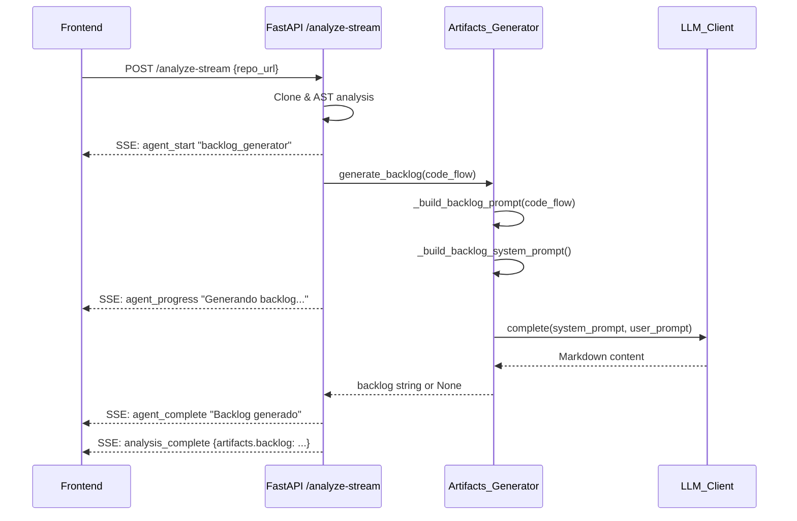

# Design Document: Backlog Generation

## Overview

Este diseño describe la implementación de la generación automática de Product Backlog para DevGhost Parser. El sistema extiende el pipeline existente de `Artifacts_Generator` con un nuevo método `generate_backlog` que, a partir del grafo de Code_Flow (nodos y edges), construye un prompt especializado para el LLM que produce un documento Markdown con épicas, historias de usuario priorizadas, story points y criterios de aceptación.

La arquitectura sigue el mismo patrón probado de los artefactos existentes (C4, ADR, RBAC, Testing, Casos de Uso): extracción de datos estructurales → construcción de prompt contextual → invocación del LLM → validación de respuesta → entrega al frontend.

### Decisiones de Diseño Clave

1. **Reusar el patrón de Artifacts_Generator**: Mantiene consistencia con `generate_use_cases`, `generate_c4_diagram`, etc.
2. **Prompt engineering sobre lógica compleja**: La agrupación en épicas, estimación de SP y priorización se delegan al LLM con contexto estructural rico, en lugar de implementar algoritmos de clasificación propios.
3. **Cálculo de centralidad en el prompt builder**: La información de in-degree y dependencias se pre-computa antes de enviarla al LLM para guiar la priorización.
4. **Guard conditions consistentes**: Mismo patrón de retorno `None` cuando no hay datos relevantes o el LLM no está disponible.

## Architecture

```mermaid
flowchart TD
    subgraph Backend["Backend (Python)"]
        CF[Code_Flow_Analyzer] --> CFR[CodeFlowResult]
        CFR --> AG[Artifacts_Generator]
        AG --> GB[generate_backlog]
        GB --> PB[_build_backlog_prompt]
        GB --> SP[_build_backlog_system_prompt]
        PB --> LLM[LLM_Client.complete]
        SP --> LLM
        LLM --> MD[Markdown Backlog]
    end

    subgraph Frontend["Frontend (React)"]
        DP[DocumentationPanel] --> BT[Backlog Tab]
        BT --> MR[MarkdownRenderer]
    end

    subgraph SSE["SSE Pipeline"]
        STREAM[/analyze-stream] --> EVT[agent_progress events]
        EVT --> DP
    end

    MD --> STREAM
```

### Flujo de Datos



## Components and Interfaces

### Backend Components

#### `Artifacts_Generator.generate_backlog(code_flow: CodeFlowResult) -> str | None`

Método principal. Sigue el patrón de `generate_use_cases`:

```python
def generate_backlog(self, code_flow: "CodeFlowResult | None") -> str | None:
    """Generate Product Backlog from Controller/Route analysis."""
    if not self._llm_client or not self._llm_client.available:
        return None
    if not code_flow or not code_flow.nodes:
        return None

    controllers = [n for n in code_flow.nodes if n.type in ("Controller", "Route")]
    controllers_with_methods = [c for c in controllers if c.method_names]
    if not controllers_with_methods:
        return None

    user_prompt = self._build_backlog_prompt(code_flow, controllers_with_methods)
    system_prompt = self._build_backlog_system_prompt()

    result = self._llm_client.complete(system_prompt, user_prompt)
    return result if result and result.strip() else None
```

#### `Artifacts_Generator._build_backlog_prompt(code_flow: CodeFlowResult, controllers: list[Node]) -> str`

Construye el prompt de usuario con toda la información estructural:
- Nombres y tipos de cada controlador con sus métodos
- Servicios, repositorios y middleware conectados (vía edges)
- Información de centralidad (in-degree de cada controlador)
- Servicios transversales (conectados a múltiples controladores)
- Número de dependencias por método para guiar la estimación de SP

#### `Artifacts_Generator._build_backlog_system_prompt() -> str`

Retorna el system prompt que instruye al LLM sobre:
- Formato de salida Markdown con jerarquía de encabezados
- Estructura de historia de usuario (Como/Quiero/Para)
- Escala Fibonacci para story points
- Niveles de prioridad (Alta, Media, Baja)
- Agrupación en épicas por dominio funcional
- Tabla resumen al inicio
- Identificadores HU-XXX
- Criterios de aceptación por historia
- Idioma español
- Ordenamiento por prioridad descendente dentro de cada épica

### Frontend Components

#### `DocumentationPanel` (modificación)

Extensión del componente existente:

```typescript
// Nuevo tipo de tab
type ArtifactTab = 'c4' | 'dictionary' | 'adr' | 'rbac' | 'testing' | 'usecases' | 'backlog';

// Nueva entrada en el array tabs
{ id: 'backlog', label: 'Backlog', icon: '📋' }

// getContent case
if (tab === 'backlog') return artifacts.backlog || FALLBACK_BACKLOG;
```

#### `ArtifactsResponse` (extensión de tipos)

```typescript
export interface ArtifactsResponse {
  // ... campos existentes ...
  backlog: string | null;
}
```

## Data Models

### Entrada: CodeFlowResult (existente, sin cambios)

```python
@dataclass
class CodeFlowResult:
    nodes: list[Node]    # Nodos con id, label, type, method_names
    edges: list[Edge]    # Relaciones source→target con relation type
    errors: list[AnalysisError]
```

### Datos Derivados para el Prompt

```python
@dataclass
class ControllerContext:
    """Datos pre-computados de un controlador para el prompt."""
    node: Node
    services: list[str]       # Labels de servicios conectados
    repositories: list[str]   # Labels de repositorios conectados
    middleware: list[str]     # Labels de middleware conectado
    in_degree: int            # Número de edges entrantes (centralidad)
    out_degree: int           # Número de dependencias salientes (complejidad)

@dataclass
class CrossCuttingService:
    """Servicio invocado por múltiples controladores."""
    label: str
    connected_controllers: list[str]  # Labels de controladores que lo usan
```

Nota: Estos dataclasses son internos al método `_build_backlog_prompt` y no se exponen en la API. Se usan como estructuras intermedias para organizar la información antes de serializar el prompt.

### Salida: Markdown (campo en respuesta existente)

```json
{
  "artifacts": {
    "c4Mermaid": "...",
    "dbDictionary": "...",
    "adrDocument": "...",
    "rbacMatrix": "...",
    "testPlan": "...",
    "useCases": "...",
    "backlog": "## Product Backlog\n\n| Métrica | Valor |\n..."
  }
}
```

## Correctness Properties

*A property is a characteristic or behavior that should hold true across all valid executions of a system — essentially, a formal statement about what the system should do. Properties serve as the bridge between human-readable specifications and machine-verifiable correctness guarantees.*

### Property 1: Prompt completeness — all structural context is included

*For any* valid CodeFlowResult containing Controller or Route nodes with methods connected via edges to Service, Repository, and Middleware nodes, the constructed prompt SHALL include all controller labels, all method names of those controllers, and the labels of all directly connected services, repositories, and middleware nodes.

**Validates: Requirements 1.1, 1.2, 1.3, 7.1, 7.5**

### Property 2: Controllers without methods are excluded

*For any* CodeFlowResult containing a mix of Controller/Route nodes with and without methods, the constructed prompt SHALL NOT include any controller whose `method_names` list is empty.

**Validates: Requirements 1.5**

### Property 3: Cross-cutting services are identified

*For any* CodeFlowResult where a Service node has incoming edges from two or more Controller/Route nodes, the prompt construction SHALL identify that service as cross-cutting and include it with its connected controller labels.

**Validates: Requirements 2.4**

### Property 4: Graph centrality metrics are included

*For any* CodeFlowResult with edges, the constructed prompt SHALL include the in-degree count (number of incoming edges) for each Controller/Route node, reflecting its centrality in the dependency graph.

**Validates: Requirements 3.2, 3.4**

### Property 5: No controllers or routes yields None

*For any* CodeFlowResult that contains zero nodes of type Controller or Route (regardless of how many Service, Utility, Middleware, Repository, or Config nodes exist), `generate_backlog` SHALL return None.

**Validates: Requirements 4.5**

### Property 6: LLM unavailable yields None

*For any* CodeFlowResult input (including valid ones with controllers and methods), when the LLM_Client has `available == False`, `generate_backlog` SHALL return None.

**Validates: Requirements 5.3**

### Property 7: LLM empty response yields None

*For any* valid CodeFlowResult input where the LLM_Client returns None or an empty/whitespace-only string, `generate_backlog` SHALL return None.

**Validates: Requirements 7.4**

## Error Handling

### Guard Conditions (retorno None)

| Condición | Comportamiento | Requisito |
|-----------|----------------|-----------|
| `code_flow` es None o vacío | Retorna None | 4.5 |
| No hay nodos Controller/Route | Retorna None | 4.5 |
| No hay controllers con métodos | Retorna None | 1.5 |
| `LLM_Client.available == False` | Retorna None | 5.3 |
| LLM retorna None o string vacío | Retorna None | 7.4 |

### Manejo de Errores en SSE Pipeline

- Si `generate_backlog` retorna None durante el streaming, el campo `artifacts.backlog` se establece como `null` en la respuesta final.
- Si ocurre una excepción no manejada, se emite un evento SSE `agent_error` para el agente de backlog y se continúa con los demás artefactos (tolerancia a fallos existente).

### Frontend

- Cuando `artifacts.backlog` es `null` o ausente, el DocumentationPanel muestra el mensaje fallback: "No se pudo generar el backlog. Intenta analizar nuevamente."
- Los botones de Copiar y Descargar operan sobre el contenido actual del tab (mismo comportamiento que los demás artefactos).

## Testing Strategy

### Property-Based Tests (Hypothesis)

Se utilizará **Hypothesis** (ya presente en el proyecto como dependencia de desarrollo) para implementar los 7 correctness properties definidos anteriormente.

**Configuración:**
- Mínimo 100 iteraciones por propiedad (`@settings(max_examples=100)`)
- Cada test referenciará su propiedad del diseño con un tag en comentario

**Generadores necesarios:**
- `st_code_flow_result()`: Genera `CodeFlowResult` aleatorios con nodos de varios tipos, métodos, y edges válidos (integridad referencial source→target)
- `st_node()`: Genera nodos con type, label, y method_names aleatorios
- `st_edge()`: Genera edges con source/target válidos dentro del grafo

**Tag format:** `# Feature: backlog-generation, Property {N}: {title}`

### Unit Tests (pytest)

- Verificar que el system prompt contiene instrucciones clave (idioma español, Fibonacci, formato Markdown, etc.)
- Verificar integración con `Artifacts_Generator.__init__` y la inyección de `LLM_Client`
- Verificar que `generate_backlog` llama a `LLM_Client.complete` con los prompts correctos (mock)

### Frontend Tests (Vitest + Testing Library)

- Verificar que el tab "Backlog" con ícono 📋 aparece en DocumentationPanel
- Verificar que `MarkdownRenderer` se usa cuando `artifacts.backlog` tiene contenido
- Verificar que el mensaje fallback se muestra cuando `artifacts.backlog` es null
- Verificar que los botones Copiar/Descargar funcionan en el tab Backlog
- Verificar que `ArtifactsResponse` incluye el campo `backlog: string | null`

### Integration Tests

- Test del endpoint `/analyze-stream` verificando que eventos SSE de backlog se emiten
- Test de que `artifacts.backlog` aparece en la respuesta final del análisis
