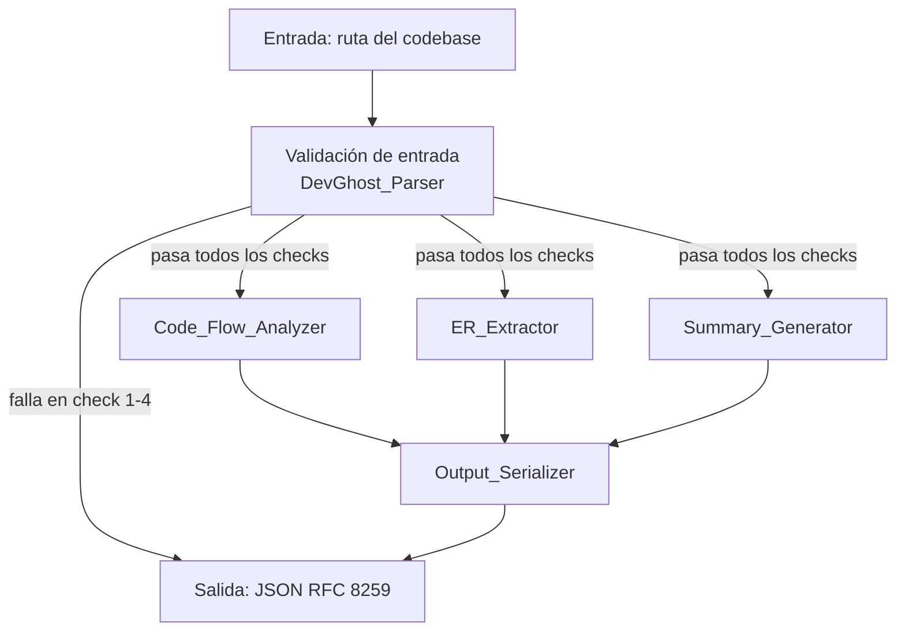
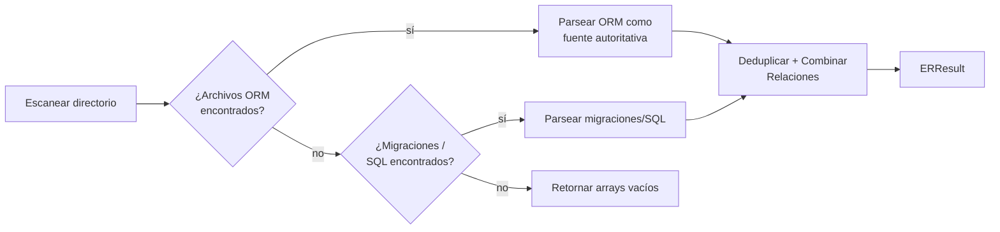
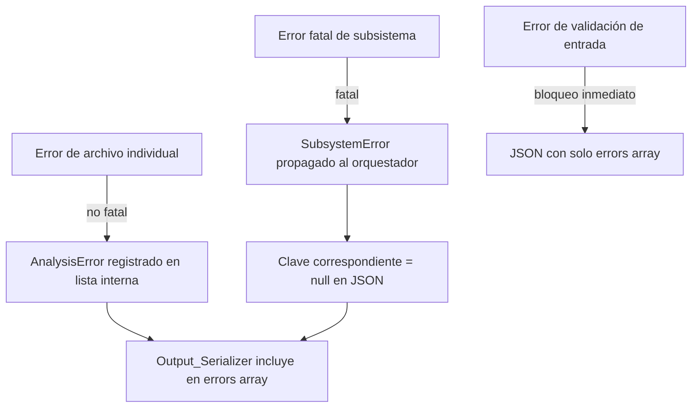

# Documento de Diseño: DevGhost-Parser

## Overview

DevGhost-Parser es un sistema de análisis estático de arquitectura de software que examina un directorio de código fuente y produce un único objeto JSON estructurado. La salida describe tres dimensiones complementarias del código base analizado:

1. **Grafo de flujo de código** — nodos y aristas compatibles con React Flow que representan entidades arquitectónicas y sus dependencias.
2. **Modelo Entidad-Relación** — entidades y relaciones extraídas de ORMs, migraciones o scripts SQL.
3. **Resumen ejecutivo narrado** — texto plano apto para síntesis de voz, máximo 500 puntos de código Unicode.

El sistema opera exclusivamente como analizador estático: no ejecuta el código fuente ni accede a bases de datos en tiempo de ejecución. La salida es siempre JSON válido conforme a RFC 8259, sin markdown, sin BOM, sin texto fuera del objeto JSON.

### Tecnologías Clave

| Componente | Tecnología elegida | Justificación |
|---|---|---|
| Análisis AST multi-lenguaje | [tree-sitter](https://tree-sitter.github.io/tree-sitter/) + `tree-sitter` Python bindings | Parseo incremental, soporte nativo para PHP, JS, TS, Python, Ruby, Go, Rust, Java, C# sin escribir parsers propios |
| Serialización JSON | Módulo estándar `json` de Python con `ensure_ascii=False`, codificado como UTF-8 sin BOM | RFC 8259 compliant; control total sobre BOM y escaping |
| Pruebas de propiedades | [Hypothesis](https://hypothesis.readthedocs.io/) (Python) | Biblioteca madura, generadores ricos, integración con pytest |

---

## Architecture

El sistema sigue un patrón de **orquestador + subsistemas paralelos** con un serializador de salida que actúa como única puerta de salida.



### Flujo de procesamiento

1. **DevGhost_Parser** recibe la ruta del código base y ejecuta los 4 checks de validación en orden estricto (ausente → no existe → sin permisos → no es directorio). Si alguno falla, emite el JSON de error sin invocar ningún subsistema.
2. Si la validación pasa, los tres subsistemas analíticos se invocan de forma independiente. Cada uno puede fallar de forma aislada sin detener a los demás.
3. **Output_Serializer** recoge los resultados (o errores) de cada subsistema, compone el objeto final y lo serializa como UTF-8 sin BOM.

---

## Components and Interfaces

### DevGhost_Parser (Orquestador)

```python
class DevGhost_Parser:
    def analyze(self, path: str) -> bytes:
        """
        Punto de entrada principal.
        Retorna bytes UTF-8 sin BOM de un objeto JSON válido RFC 8259.
        Nunca lanza excepciones: los errores se codifican en el JSON de salida.
        """
```

**Responsabilidades:**
- Ejecutar la secuencia de validación de entrada en el orden mandatorio.
- Instanciar y coordinar `Code_Flow_Analyzer`, `ER_Extractor` y `Summary_Generator`.
- Pasar los resultados parciales a `Output_Serializer`.

### Code_Flow_Analyzer

```python
class Code_Flow_Analyzer:
    def analyze(self, root_path: str) -> CodeFlowResult:
        """
        Retorna CodeFlowResult con campos:
          nodes: list[Node]
          edges: list[Edge]
          errors: list[AnalysisError]   # errores no fatales de archivos individuales
        Lanza AnalysisFatalError si root_path es inaccesible.
        """
```

**Proceso interno:**
1. Recorrer recursivamente el directorio con `os.walk`.
2. Para cada archivo con extensión reconocida, determinar el lenguaje y obtener el parser `tree-sitter` correspondiente.
3. Extraer la clase o módulo principal usando consultas S-expression de tree-sitter para identificar `class_declaration`, `function_declaration`, imports/requires.
4. Clasificar el archivo en una de las categorías arquitectónicas: `Controller`, `Service`, `Route`, `Middleware`, `Repository`, `Utility`.
5. Generar `Node` con `id` = hash estable del path relativo, `label` = nombre de clase o nombre de archivo, `type` = categoría.
6. Generar `Edge` por cada import/require/use detectado, con `source` = id del archivo actual, `target` = id del archivo importado, `relation` = `"imports"` | `"calls"` | `"depends_on"`.
7. Aplicar filtro de integridad referencial: eliminar aristas cuyo `source` o `target` no estén en el conjunto de `id` de nodos generados.

**Estrategia de clasificación arquitectónica:**

| Patrón (nombre de archivo o clase) | Categoría asignada |
|---|---|
| `*Controller*`, `*_controller*` | `Controller` |
| `*Service*`, `*_service*` | `Service` |
| `*Route*`, `router*`, `routes*` | `Route` |
| `*Middleware*`, `*_middleware*` | `Middleware` |
| `*Repository*`, `*Repo*` | `Repository` |
| todo lo demás | `Utility` |

### ER_Extractor

```python
class ER_Extractor:
    def extract(self, root_path: str) -> ERResult:
        """
        Retorna ERResult con campos:
          entities: list[Entity]
          relations: list[Relation]
          errors: list[AnalysisError]   # archivos omitidos
        """
```

**Proceso interno (por prioridad de fuente):**



**Parseo por ORM:**

| ORM | Extensión / marcador | Estrategia de extracción |
|---|---|---|
| Eloquent (Laravel) | `*.php` + `extends Model` | tree-sitter PHP: extraer clase, propiedades `$fillable`, `$casts`, métodos de relación (`hasMany`, `belongsTo`, etc.) |
| Prisma | `schema.prisma` | Parser regex/tree-sitter para bloques `model { }` |
| SQLAlchemy | `*.py` + `declarative_base` o `Base` | tree-sitter Python: clases que heredan de `Base`, columnas `Column(...)` |
| Migraciones SQL / scripts | `*.sql`, `*.migration.*` | Regex + árbol sintáctico: `CREATE TABLE`, `ALTER TABLE ADD FOREIGN KEY` |

**Deduplicación:** al encontrar la misma entidad en múltiples fuentes, prevalece ORM > migración > SQL crudo.

### Summary_Generator

```python
class Summary_Generator:
    def generate(
        self,
        code_flow: CodeFlowResult | None,
        er_result: ERResult | None,
        root_path: str,
    ) -> str:
        """
        Retorna un string de máximo 500 puntos de código Unicode,
        máximo 3 oraciones, libre de caracteres prohibidos.
        Nunca lanza excepciones.
        """
```

**Proceso interno:**
1. Contar tipos de nodos del grafo de código para inferir el patrón arquitectónico dominante.
2. Listar las entidades principales del modelo ER.
3. Construir un resumen en lenguaje natural usando plantillas de texto plano.
4. Sanitizar: eliminar `*, #, \`, _, ~, >, <>`, identificadores camelCase/snake_case, caracteres de control U+0000–U+001F.
5. Truncar a 500 puntos de código si es necesario.
6. Si no hay archivos reconocibles, retornar la cadena fija: `"No analyzable source files were found in the provided codebase."`
7. Si algún subsistema falló, agregar una oración indicando que el resumen puede estar incompleto.

### Output_Serializer

```python
class Output_Serializer:
    def serialize(
        self,
        code_flow: CodeFlowResult | None,
        er_result: ERResult | None,
        summary: str | None,
        subsystem_errors: list[SubsystemError],
    ) -> bytes:
        """
        Retorna bytes UTF-8 sin BOM que conforman un objeto JSON RFC 8259.
        Sin espacios iniciales/finales, sin BOM, sin caracteres de control sin escapar.
        """
```

**Reglas de composición:**
- Si todos los subsistemas tienen éxito: emite `{ "codeFlow": {...}, "erModel": {...}, "summary": "..." }` sin clave `errors`.
- Si algún subsistema falla: la clave correspondiente se establece en `null` y se agrega `"errors": [{"subsystem": "...", "message": "..."}]`.
- La serialización final usa `json.dumps(obj, ensure_ascii=False)` seguido de `.encode("utf-8")` para producir bytes sin BOM.

---

## Data Models

### Nodo (Node)

```json
{
  "id": "string",
  "label": "string",
  "type": "Controller | Service | Route | Middleware | Repository | Utility"
}
```

| Campo | Tipo | Descripción |
|---|---|---|
| `id` | string | Identificador único, estable entre ejecuciones. Hash SHA-1 del path relativo. |
| `label` | string | Nombre de la clase principal o nombre del archivo sin extensión. |
| `type` | string | Categoría arquitectónica del archivo. |

### Arista (Edge)

```json
{
  "source": "string",
  "target": "string",
  "relation": "imports | calls | depends_on"
}
```

| Campo | Tipo | Descripción |
|---|---|---|
| `source` | string | `id` del nodo origen. |
| `target` | string | `id` del nodo destino. |
| `relation` | string | Tipo de relación: `"imports"`, `"calls"`, o `"depends_on"`. |

> **Invariante:** todo `source` y `target` DEBE corresponder al `id` de un nodo presente en el array `nodes` de la misma respuesta.

### Entidad (Entity)

```json
{
  "name": "string",
  "attributes": [
    { "name": "string", "type": "string" }
  ],
  "primaryKey": "string"
}
```

### Relación ER (Relation)

```json
{
  "from": "string",
  "to": "string",
  "type": "one-to-one | one-to-many | many-to-many | unknown",
  "foreignKey": "string",
  "rawDeclaration": "string (solo si type == unknown)"
}
```

### Estructura de Salida Completa

```json
{
  "codeFlow": {
    "nodes": [ /* Node[] */ ],
    "edges": [ /* Edge[] */ ]
  },
  "erModel": {
    "entities": [ /* Entity[] */ ],
    "relations": [ /* Relation[] */ ]
  },
  "summary": "string",
  "errors": [
    { "subsystem": "string", "message": "string" }
  ]
}
```

> La clave `errors` SOLO aparece cuando al menos un subsistema falla. Cuando todos tienen éxito, se omite completamente.

### Estructura de Error de Validación de Entrada

```json
{
  "errors": [
    { "message": "string" }
  ]
}
```

---

## Correctness Properties

*Una propiedad es una característica o comportamiento que debe mantenerse verdadero en todas las ejecuciones válidas del sistema: esencialmente, una declaración formal sobre lo que el sistema debe hacer. Las propiedades sirven como puente entre especificaciones legibles por humanos y garantías de corrección verificables por máquina.*

### Property 1: Integridad referencial del grafo de flujo

*Para todo* código base válido analizado, cada arista en el array `edges` de la salida debe tener tanto `source` como `target` correspondiendo al `id` de un nodo existente en el array `nodes` de la misma respuesta.

**Validates: Requirements 1.3, 1.5**

---

### Property 2: Los nodos generados contienen los campos requeridos

*Para todo* archivo fuente identificado como entidad arquitectónica, el nodo generado debe contener un `id` no vacío, un `label` no vacío, y un `type` cuyo valor pertenece al conjunto `{Controller, Service, Route, Middleware, Repository, Utility}`.

**Validates: Requirements 1.2**

---

### Property 3: Unicidad de entidades ER

*Para todo* código base que contiene definiciones de modelos, el array `entities` en la salida no debe contener dos entidades con el mismo `name`.

**Validates: Requirements 2.5**

---

### Property 4: Estructura completa de entidades ER

*Para toda* entidad extraída, el objeto debe contener un campo `name` no vacío, un array `attributes` (posiblemente vacío), y un campo `primaryKey`.

**Validates: Requirements 2.1**

---

### Property 5: El resumen respeta el límite de 500 puntos de código

*Para todo* código base analizado, la longitud en puntos de código Unicode del campo `summary` en la salida debe ser menor o igual a 500.

**Validates: Requirements 3.4**

---

### Property 6: El resumen está libre de caracteres prohibidos

*Para todo* código base analizado, el campo `summary` no debe contener ninguno de los caracteres del conjunto `{*, #, \`, _, ~, >, <, >}` ni caracteres de control en el rango U+0000–U+001F.

**Validates: Requirements 3.2**

---

### Property 7: Serialización de ida y vuelta (round-trip)

*Para todo* resultado de análisis válido, serializar el objeto a JSON y luego parsearlo debe producir un objeto con: (a) exactamente el mismo conjunto de claves de nivel superior, (b) valores del mismo tipo JSON en cada clave, (c) valores escalares idénticos en cada ruta de campo, y (d) arrays con el mismo número de elementos y los mismos valores en el mismo orden.

**Validates: Requirements 6.1**

---

### Property 8: La salida es UTF-8 sin BOM

*Para todo* resultado de análisis, los bytes de salida no deben comenzar con la secuencia de marca de orden de bytes UTF-8 `EF BB BF`, y deben ser decodificables como UTF-8 válido.

**Validates: Requirements 4.1, 6.2**

---

### Property 9: Los caracteres de control no aparecen sin escapar

*Para todo* resultado de análisis, ningún carácter en el rango U+0000–U+001F debe aparecer sin escapar en la cadena JSON de salida (es decir, todos deben representarse como secuencias `\uXXXX` cuando están dentro de valores de cadena).

**Validates: Requirements 6.3**

---

### Property 10: Orden de validación de entrada

*Para todo* par de condiciones de error de entrada, si la primera condición en el orden mandatorio (ausente → no existe → sin permisos → no directorio) es verdadera, la respuesta debe contener exactamente ese error y no el error de una condición de menor prioridad.

**Validates: Requirements 5.5**

---

## Error Handling

### Clasificación de errores

| Nivel | Tipo | Comportamiento |
|---|---|---|
| **Fatal de entrada** | Path ausente, no encontrado, sin permisos, no es directorio | DevGhost_Parser retorna `{"errors": [{"message": "..."}]}` inmediatamente, sin invocar subsistemas |
| **Fatal de subsistema** | Code_Flow_Analyzer, ER_Extractor, Summary_Generator no pueden completar | Output_Serializer setea la clave correspondiente en `null` y agrega entrada en `errors` de nivel superior |
| **No fatal de archivo** | Archivo individual no parseable (syntax error, encoding inválido) | El subsistema omite el archivo, continúa procesando los demás, registra `{path, reason}` en su lista interna de errores que el Output_Serializer añade al array `errors` |

### Propagación de errores



### Mensajes de error de validación (ejemplos canónicos)

| Check | Mensaje |
|---|---|
| Path ausente o vacío | `"A Target_Codebase path is required."` |
| Path no encontrado | `"Path '/ruta/dada' was not found."` |
| Sin permisos | `"Permission denied accessing '/ruta/dada'."` |
| No es directorio | `"Path '/ruta/dada' is not a directory."` |

---

## Testing Strategy

### Enfoque dual: pruebas unitarias + pruebas de propiedades

El proyecto adopta un enfoque de pruebas dual que combina:

- **Pruebas unitarias** (pytest): validan ejemplos concretos, casos límite y condiciones de error.
- **Pruebas de propiedades** ([Hypothesis](https://hypothesis.readthedocs.io/)): validan propiedades universales ejecutando cada test con al menos 100 iteraciones de datos generados aleatoriamente.

### Pruebas unitarias

| Área | Qué verificar |
|---|---|
| Validación de entrada | Los 4 checks en orden, con ejemplos concretos de cada condición |
| Clasificación arquitectónica | Que `UserController.php` → `Controller`, `orderService.ts` → `Service`, etc. |
| Generación de IDs de nodo | Que el mismo path siempre produce el mismo `id` |
| Parsing de Prisma | Un `schema.prisma` de ejemplo produce las entidades y relaciones correctas |
| Parsing de SQLAlchemy | Un modelo `Base` de ejemplo produce la entidad correcta |
| Resumen con código base vacío | Retorna la cadena fija mandatoria |
| Salida cuando un subsistema falla | La clave correspondiente es `null` y `errors` contiene la entrada correcta |
| Salida cuando todos tienen éxito | La clave `errors` está ausente |

### Pruebas de propiedades (Hypothesis)

Cada propiedad del diseño se implementa como un único test de Hypothesis con mínimo 100 iteraciones.

```python
# Formato de etiqueta para cada test
# Feature: dev-ghost-parser, Property {N}: {texto de la propiedad}
```

| Propiedad | Estrategia de generadores |
|---|---|
| P1: Integridad referencial | Generar listas de nodos y aristas aleatorias, invocar el filtro de integridad, verificar que todas las aristas referencian nodos existentes |
| P2: Campos de nodo requeridos | Generar paths de archivo aleatorios, verificar que cada nodo tiene `id`, `label`, `type` válidos |
| P3: Unicidad de entidades ER | Generar conjuntos de nombres de entidad con posibles duplicados de distintas fuentes, verificar que el resultado no tiene duplicados |
| P4: Estructura completa de entidades | Generar definiciones de modelo aleatorias, verificar que cada entidad tiene todos los campos requeridos |
| P5: Límite de 500 puntos de código del resumen | Generar resultados de análisis arbitrarios, verificar `len(summary) <= 500` |
| P6: Caracteres prohibidos en resumen | Generar texto con caracteres especiales, verificar ausencia de caracteres prohibidos tras sanitización |
| P7: Round-trip de serialización | Generar objetos de resultado arbitrarios, verificar que `json.loads(json.dumps(obj)) == obj` con las condiciones del requisito |
| P8: UTF-8 sin BOM | Generar objetos de resultado arbitrarios, verificar que la salida en bytes no comienza con `\xef\xbb\xbf` |
| P9: Caracteres de control sin escapar | Generar strings con caracteres de control, verificar que la salida JSON los escapa con `\uXXXX` |
| P10: Orden de validación de entrada | Generar combinaciones de condiciones de error, verificar que solo se retorna el error del check de mayor prioridad |

### Cobertura mínima esperada

- Cobertura de ramas en `DevGhost_Parser.analyze()`: 100%
- Cobertura de ramas en `Output_Serializer.serialize()`: 100%
- Cobertura de ramas en cada subsistema: ≥ 85%
