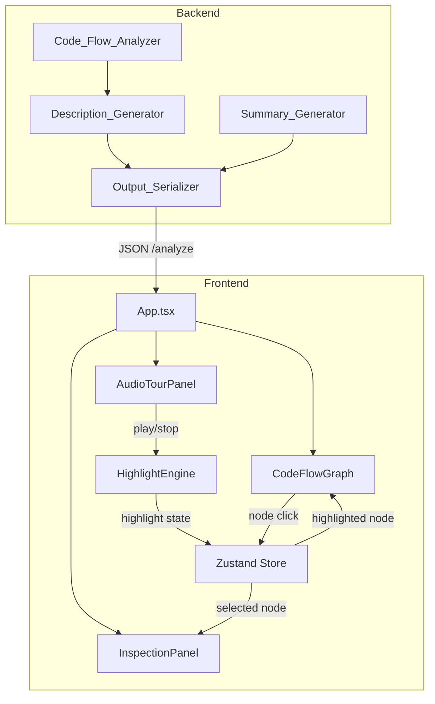

# Design Document: Interactive UX Enhancements

## Overview

This design extends the DevGhost-Parser web visualization with five interconnected enhancements that enrich contextual information and add interactive narrative capabilities. The changes span both the Python/FastAPI backend (enriching node data with AI-free heuristic descriptions, extending the summary to 3–4 sentences) and the React/TypeScript frontend (inspection panel, live node highlighting during audio tour, and node subtitle aesthetics).

**Key design decisions:**
- **No LLM dependency**: Node descriptions are generated via heuristic rules based on node type, label, and file context (imports, class name, method names). This keeps the system fast, deterministic, and free of external API calls.
- **Zustand for shared state**: A lightweight store manages inspection panel state and highlight engine state, enabling clean communication between CodeFlowGraph and AudioTourPanel without prop drilling.
- **Additive data model change**: The `Node` dataclass gains an optional `description` field with a default value, ensuring backward compatibility with existing tests and serialization.

## Architecture

### High-Level Component Interaction



### Data Flow

1. **Backend**: `Code_Flow_Analyzer` produces nodes → `Description_Generator` enriches each node with a `description` field → `Output_Serializer` includes `description` in the JSON response.
2. **Frontend**: Response is received → `CodeFlowGraph` renders nodes with subtitles from `description` → user clicks a node → `InspectionPanel` opens with full details → user plays audio tour → `HighlightEngine` sequences node highlights via the zustand store → `CodeFlowGraph` applies glow effects and viewport panning.

## Components and Interfaces

### Backend Components

#### Description_Generator (NEW)

**Location**: `backend/src/dev_ghost_parser/description_generator.py`

**Responsibility**: Generate concise Spanish-language purpose descriptions for nodes based on available context.

```python
class Description_Generator:
    """Generates ≤120-char Spanish descriptions for architectural nodes."""

    def generate(self, node: Node, file_context: FileContext | None) -> str:
        """Return a Spanish description for the given node.

        Parameters
        ----------
        node : Node
            The node to describe (has id, label, type).
        file_context : FileContext | None
            Optional context including imports, class_name, method_names.
            When None, a generic type-based fallback is used.

        Returns
        -------
        str
            A Spanish description of ≤120 characters, never empty.
        """
```

**Heuristic Strategy:**
1. If `file_context` is provided with method names, compose a description like: "Controlador que gestiona [inferred purpose from methods]".
2. If only imports are available, infer purpose from imported modules.
3. Fallback: return a generic description based on NodeType:
   - Controller → "Controlador principal del sistema"
   - Service → "Servicio auxiliar del sistema"
   - Route → "Definición de rutas del sistema"
   - Middleware → "Middleware de procesamiento intermedio"
   - Repository → "Repositorio de acceso a datos"
   - Utility → "Utilidad auxiliar del proyecto"

#### FileContext (NEW data class)

```python
@dataclass
class FileContext:
    """Context extracted from a source file for description generation."""
    imports: list[str] = field(default_factory=list)
    class_name: str | None = None
    method_names: list[str] = field(default_factory=list)
```

#### Modified: Output_Serializer

The `_code_flow_to_dict` function is updated to include `description`:

```python
def _code_flow_to_dict(code_flow: CodeFlowResult) -> dict:
    return {
        "nodes": [
            {"id": node.id, "label": node.label, "type": node.type, "description": node.description}
            for node in code_flow.nodes
        ],
        "edges": [...],
    }
```

#### Modified: Summary_Generator

The `generate` method is updated to produce 3–4 sentences (up from ≤3) and use Spanish type names:

- Sentence 1: Architecture pattern and component count (existing)
- Sentence 2: Data model scope — entity count and sample names (existing, when entities present)
- Sentence 3: Component type breakdown using Spanish names (NEW): "Los componentes incluyen {n} controladores, {n} servicios, y {n} rutas."
- Sentence 4: General purpose inference (NEW, optional): "El sistema parece orientado a [inferred purpose]."

The `_MAX_SENTENCES` constant changes from 3 to 4. The existing `_MAX_CODE_POINTS = 500` constraint remains.

### Frontend Components

#### Zustand Store (NEW)

**Location**: `frontend/src/store/useGraphStore.ts`

```typescript
import { create } from 'zustand';
import type { CodeFlowNode, CodeFlowEdge } from '../types';

interface GraphState {
  // Inspection panel
  selectedNode: CodeFlowNode | null;
  inspectionOpen: boolean;
  selectNode: (node: CodeFlowNode) => void;
  closeInspection: () => void;

  // Highlight engine
  highlightedNodeId: string | null;
  isTouring: boolean;
  startTour: (nodeIds: string[]) => void;
  stopTour: () => void;
  setHighlightedNode: (id: string | null) => void;

  // Graph data reference (for dependency lookup)
  edges: CodeFlowEdge[];
  nodes: CodeFlowNode[];
  setGraphData: (nodes: CodeFlowNode[], edges: CodeFlowEdge[]) => void;
}
```

#### InspectionPanel (NEW)

**Location**: `frontend/src/components/InspectionPanel.tsx`

**Props**: None (reads from zustand store)

**Behavior**:
- Slides in from the right when `inspectionOpen` is true
- Displays: node label, type badge (colored), description, dependencies list, related tables
- Dependencies: derived from `edges.filter(e => e.source === selectedNode.id)`
- Related tables: edges with relation "calls" or "depends_on" targeting Repository-type nodes
- Shows "Sin dependencias directas detectadas" when no outgoing edges exist
- Close button sets `inspectionOpen = false`

**Layout**: Fixed-width (320px) panel on the right side; the graph container shrinks accordingly using flex layout.

#### HighlightEngine (NEW)

**Location**: `frontend/src/hooks/useHighlightEngine.ts`

**Interface**: A custom React hook that manages highlight sequencing.

```typescript
function useHighlightEngine(
  nodes: CodeFlowNode[],
  duration: number,  // estimated narration duration in ms
  isPlaying: boolean
): void;
```

**Algorithm**:
1. On `isPlaying=true`: select one representative node per type group present in the graph.
2. Calculate interval: `duration / selectedNodes.length`.
3. Use `setInterval` to cycle through nodes, calling `setHighlightedNode(id)` on the store.
4. On `isPlaying=false` or unmount: clear interval, call `setHighlightedNode(null)`.

**Node selection strategy**: For each unique NodeType in the graph, pick the first node of that type (deterministic, stable ordering).

#### Modified: CodeFlowGraph

Changes:
1. **Read highlight state** from zustand store (`highlightedNodeId`).
2. **Apply glow effect**: When a node's id matches `highlightedNodeId`, apply a CSS box-shadow/border glow via conditional styling.
3. **Viewport panning**: When `highlightedNodeId` changes, call `reactFlowInstance.fitView({ nodes: [{ id: highlightedNodeId }], duration: 800 })` to smoothly pan to the highlighted node.
4. **Node click handler**: Call `store.selectNode(nodeData)` on node click.
5. **Subtitle rendering**: Add a subtitle line in CustomNode showing the truncated description.
6. **Layout adjustment**: Increase `NODE_HEIGHT` to accommodate subtitle text.

#### Modified: AudioTourPanel

Changes:
1. **Integrate highlight engine**: Call `useHighlightEngine` with estimated narration duration.
2. **Expose playing state** to zustand store: on play → `store.startTour(nodeIds)`, on stop/end → `store.stopTour()`.
3. **Duration estimation**: Use `summary.length * 80ms` as a rough TTS duration estimate (adjustable).

#### Modified: App.tsx

Changes:
1. Add `<InspectionPanel />` component alongside the graph.
2. Pass graph data to zustand store on response load.
3. Adjust layout: wrap graph + panel in a flex container.

### Frontend Type Changes

**Location**: `frontend/src/types.ts`

```typescript
export interface CodeFlowNode {
  id: string;
  label: string;
  type: NodeType;
  description: string;  // NEW: ≤120 chars, Spanish
}
```

## Data Models

### Backend Node (Modified)

```python
@dataclass
class Node:
    id: str
    label: str
    type: NodeType
    description: str = ""  # NEW: ≤120 chars, Spanish purpose description
```

### FileContext (New)

```python
@dataclass
class FileContext:
    imports: list[str] = field(default_factory=list)
    class_name: str | None = None
    method_names: list[str] = field(default_factory=list)
```

### API Response Change

The `/analyze` endpoint response `codeFlow.nodes[]` gains a `description` field:

```json
{
  "codeFlow": {
    "nodes": [
      {
        "id": "a1b2c3...",
        "label": "UserController",
        "type": "Controller",
        "description": "Controlador que gestiona las operaciones de usuario"
      }
    ],
    "edges": [...]
  },
  "erModel": {...},
  "summary": "La base de codigo sigue un patron model-view-controller con 12 componentes identificados. El modelo de datos incluye 3 entidades como User, Order, Product. Los componentes incluyen 2 controladores, 4 servicios, y 3 rutas. El sistema parece orientado a la gestion de pedidos."
}
```

### Zustand Store State Shape

```typescript
{
  selectedNode: CodeFlowNode | null,
  inspectionOpen: boolean,
  highlightedNodeId: string | null,
  isTouring: boolean,
  tourNodeIds: string[],
  edges: CodeFlowEdge[],
  nodes: CodeFlowNode[]
}
```

## Correctness Properties

*A property is a characteristic or behavior that should hold true across all valid executions of a system — essentially, a formal statement about what the system should do. Properties serve as the bridge between human-readable specifications and machine-verifiable correctness guarantees.*

### Property 1: Description generation invariant

*For any* valid Node (with any label, any NodeType, and any FileContext or None), the Description_Generator SHALL return a non-empty string of at most 120 Unicode characters.

**Validates: Requirements 1.1, 1.2**

### Property 2: Serialization includes description for all nodes

*For any* CodeFlowResult containing nodes with description fields, the Output_Serializer SHALL produce JSON where every object in the `codeFlow.nodes` array contains a `"description"` key with a string value.

**Validates: Requirements 1.6**

### Property 3: InspectionPanel renders all node data fields

*For any* CodeFlowNode with a non-empty label, type, and description, the InspectionPanel component SHALL render text content containing the node's label, type, and description.

**Validates: Requirements 2.2, 2.3**

### Property 4: InspectionPanel dependency derivation correctness

*For any* graph (set of nodes and edges) and any selected node, the dependencies displayed by InspectionPanel SHALL be exactly the set of nodes targeted by edges where the selected node is the source, and the "Tablas relacionadas" section SHALL appear if and only if there exist edges with relation "calls" or "depends_on" targeting Repository-type nodes.

**Validates: Requirements 2.4, 2.5**

### Property 5: Enhanced summary sentence count

*For any* CodeFlowResult with at least one node AND ERResult with at least one entity, the Summary_Generator SHALL produce a summary containing 3 or 4 sentences (delimited by period followed by space or end of string).

**Validates: Requirements 3.1**

### Property 6: Summary uses Spanish architectural type names

*For any* CodeFlowResult containing Controller-type nodes, the Summary_Generator output SHALL contain the Spanish term "controlador" (or its plural) and SHALL NOT contain the English term "Controller" as a standalone word.

**Validates: Requirements 3.3**

### Property 7: Summary mentions entities when present

*For any* ERResult with at least one entity, the Summary_Generator output SHALL contain either the word "entidad" or "entidades" and at least one entity name from the input.

**Validates: Requirements 3.4**

### Property 8: Summary length invariant

*For any* valid combination of CodeFlowResult and ERResult inputs, the Summary_Generator output SHALL have at most 500 Unicode code points.

**Validates: Requirements 3.5**

### Property 9: Highlight node selection covers all type groups

*For any* set of CodeFlowNodes with N distinct NodeType values (where N ≥ 1), the HighlightEngine's node selection SHALL return exactly N nodes, one for each distinct type present in the input.

**Validates: Requirements 4.1**

### Property 10: Highlight timing distribution

*For any* positive narration duration D and set of N highlight nodes (where N ≥ 1), the HighlightEngine SHALL distribute highlight intervals such that each node receives approximately D/N milliseconds of highlight time and the total of all intervals equals D.

**Validates: Requirements 4.2**

### Property 11: Subtitle truncation logic

*For any* description string, the subtitle display function SHALL return the full string when its length is less than 60 characters, and SHALL return exactly the first 57 characters followed by "..." (total 60 characters) when its length is 60 or greater.

**Validates: Requirements 5.2, 5.3**

## Error Handling

### Backend

| Scenario | Behavior |
|----------|----------|
| File cannot be read during description generation | `Description_Generator` returns the generic fallback description for the node's type. No exception propagates. |
| Description exceeds 120 chars after generation | Truncate to 120 chars (hard limit enforced in `Description_Generator.generate`). |
| Summary exceeds 500 code points with 4 sentences | Existing `_sanitize` truncation at 500 code points applies. If the 4th sentence pushes over the limit, it is omitted (graceful degradation to 3 sentences). |
| Node has empty label | Description_Generator uses the node type alone for fallback. |

### Frontend

| Scenario | Behavior |
|----------|----------|
| `description` field missing in API response (old backend) | TypeScript type allows `description?: string`; components render empty subtitle. |
| Speech synthesis unavailable | AudioTourPanel disables play button (existing behavior). HighlightEngine is never activated. |
| No nodes in graph when tour starts | HighlightEngine does nothing (empty node selection). |
| User clicks node during active tour | InspectionPanel opens; tour highlighting continues independently (non-blocking). |
| fitView call fails (no ReactFlow instance) | Silently caught; highlight glow still applies without panning. |

## Testing Strategy

### Backend Testing

**Framework**: pytest + hypothesis (already configured)

**Property-Based Tests** (minimum 100 iterations each):

| Test File | Property | Description |
|-----------|----------|-------------|
| `test_property_description_invariant.py` | Property 1 | Generate random Nodes + FileContexts, verify description is non-empty and ≤120 chars |
| `test_property_serialization_description.py` | Property 2 | Generate random CodeFlowResults with descriptions, serialize, verify all nodes have "description" key |
| `test_property_summary_sentences.py` | Property 5 | Generate random results with nodes+entities, verify 3-4 sentences |
| `test_property_summary_spanish_names.py` | Property 6 | Generate results with Controllers, verify Spanish names in output |
| `test_property_summary_entities.py` | Property 7 | Generate results with entities, verify entities mentioned |
| `test_property_summary_length.py` | Property 8 | Generate random inputs, verify ≤500 code points (extends existing test) |

**Unit Tests**:
- Description_Generator fallback for each NodeType (6 examples)
- Description_Generator with rich FileContext (specific examples)
- Summary_Generator with 3 sentences vs 4 sentences cases
- Output_Serializer with new description field

### Frontend Testing

**Framework**: vitest + fast-check + @testing-library/react

**Property-Based Tests** (minimum 100 iterations each):

| Test File | Property | Description |
|-----------|----------|-------------|
| `InspectionPanel.property.test.tsx` | Property 3 | Generate random nodes, render panel, verify label+type+description appear |
| `InspectionPanel.deps.property.test.tsx` | Property 4 | Generate random graphs, verify dependency derivation correctness |
| `highlightEngine.property.test.ts` | Property 9 | Generate random node sets, verify one-per-type selection |
| `highlightEngine.timing.property.test.ts` | Property 10 | Generate random durations+counts, verify interval distribution |
| `subtitle.property.test.ts` | Property 11 | Generate random strings, verify truncation logic |

**Unit/Example Tests**:
- InspectionPanel open/close behavior
- InspectionPanel "Sin dependencias directas detectadas" message
- AudioTourPanel integration with HighlightEngine
- CustomNode subtitle rendering
- Zustand store state transitions

**PBT Library Configuration**:
- Backend: `hypothesis` with `@settings(max_examples=100)`
- Frontend: `fast-check` with `fc.assert(property, { numRuns: 100 })`
- Tag format: `# Feature: interactive-ux-enhancements, Property {N}: {title}`
