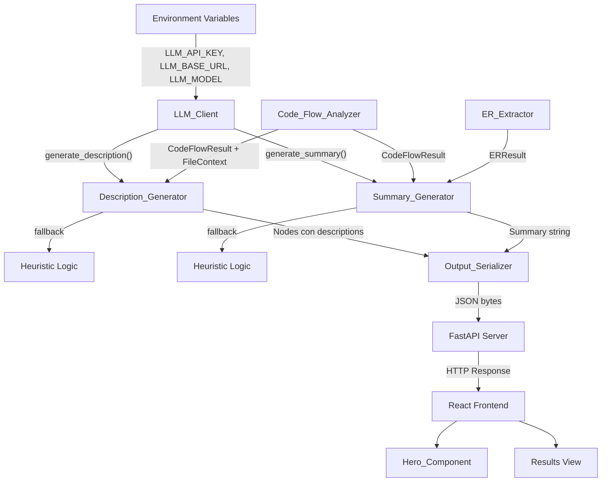
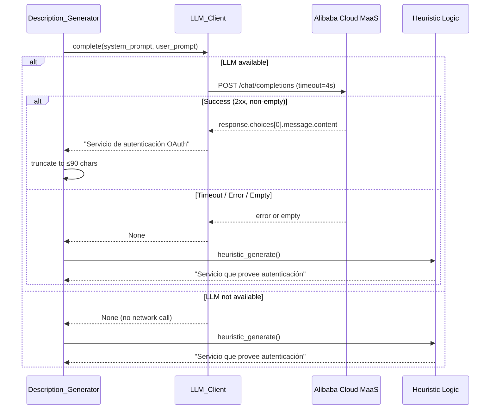

# Design Document: LLM Integration and Hero Redesign

## Overview

Este diseño aborda dos objetivos principales: (1) integrar un cliente LLM basado en la API compatible con OpenAI de Alibaba Cloud MaaS (modelo `qwen3.7-plus`) para enriquecer las descripciones de nodos y los resúmenes de audio tour con generación de texto en español, y (2) rediseñar el componente Hero del frontend React.

El cliente LLM se implementa como un módulo centralizado (`llm_client.py`) que encapsula la comunicación con la API, con timeout estricto de 4 segundos y sin reintentos. Los generadores existentes (`Description_Generator` y `Summary_Generator`) se modifican para usar el LLM como fuente primaria con fallback automático a las heurísticas locales actuales ante cualquier fallo.

El Hero Component (`InitialHeroState.tsx`) se crea como componente React/TypeScript que presenta el logo animado, tagline, input de URL y botón de análisis en un layout responsivo y accesible.

## Architecture

La arquitectura existente sigue un patrón pipeline: `Code_Flow_Analyzer` → `Description_Generator` → `Summary_Generator` → `Output_Serializer` → `FastAPI Server` → `React Frontend`. El LLM se integra como una dependencia opcional inyectada en los generadores, sin modificar la interfaz del pipeline.



**Decisiones de diseño clave:**

1. **Singleton LLM_Client**: Se instancia una sola vez y se reutiliza. El check de disponibilidad (`available`) se hace al construir, evitando llamadas innecesarias.
2. **No retry**: El requisito explícitamente prohíbe reintentos. Se configura `max_retries=0` en el SDK de OpenAI.
3. **Timeout de 4s**: Se pasa `timeout=4.0` al constructor del cliente OpenAI, que usa `httpx.Timeout` internamente.
4. **Fallback transparente**: Los generadores intentan el LLM primero; ante cualquier fallo (timeout, error HTTP, respuesta vacía, indisponibilidad), producen el resultado heurístico sin distinción observable en el JSON de salida.
5. **Límites de caracteres reducidos para LLM**: Descripciones ≤90 chars (vs. ≤120 para heurísticas) y summaries ≤450 chars (vs. ≤500 para heurísticas), para dar margen de calidad al LLM.
6. **Hero como estado inicial**: El componente Hero se muestra solo antes del primer análisis; una vez enviada una URL válida, se reemplaza por la vista de resultados.

## Components and Interfaces

### Backend

#### 1. `llm_client.py` — Módulo de Cliente LLM

```python
"""Encapsula la comunicación con Alibaba Cloud MaaS (OpenAI-compatible API)."""

import logging
import os
from typing import Optional

import openai

logger = logging.getLogger(__name__)

_DEFAULT_BASE_URL = "https://llm-pbjcab85dgzvpajw.ap-southeast-1.maas.aliyuncs.com/compatible-mode/v1"
_DEFAULT_MODEL = "qwen3.7-plus"
_TIMEOUT_SECONDS = 4.0


class LLM_Client:
    """Cliente LLM centralizado con check de disponibilidad y timeout estricto."""

    def __init__(self) -> None:
        self._available: bool = False
        self._client: Optional[openai.OpenAI] = None
        self._model: str = os.environ.get("LLM_MODEL", _DEFAULT_MODEL)

        api_key = os.environ.get("LLM_API_KEY", "").strip()
        if not api_key:
            return  # available remains False

        base_url = os.environ.get("LLM_BASE_URL", _DEFAULT_BASE_URL).strip()
        if not base_url.startswith(("http://", "https://")):
            return  # invalid URL, available remains False

        self._client = openai.OpenAI(
            api_key=api_key,
            base_url=base_url,
            timeout=_TIMEOUT_SECONDS,
            max_retries=0,
        )
        self._available = True

    @property
    def available(self) -> bool:
        """True si el cliente está configurado y listo para hacer requests."""
        return self._available

    def complete(self, system_prompt: str, user_prompt: str) -> Optional[str]:
        """Envía un prompt al LLM y retorna el texto generado, o None ante cualquier error.

        No propaga excepciones. Loguea warnings ante fallos.
        """
        if not self._available:
            return None

        try:
            response = self._client.chat.completions.create(
                model=self._model,
                messages=[
                    {"role": "system", "content": system_prompt},
                    {"role": "user", "content": user_prompt},
                ],
                max_tokens=200,
            )
            content = response.choices[0].message.content
            return content.strip() if content else None

        except openai.APITimeoutError as exc:
            logger.warning("LLM timeout: %s", exc)
            return None
        except openai.APIConnectionError as exc:
            logger.warning("LLM connection error: %s", exc)
            return None
        except openai.APIError as exc:
            logger.warning("LLM API error (status %s): %s", getattr(exc, 'status_code', '?'), exc)
            return None
        except Exception as exc:
            logger.warning("LLM unexpected error: %s", exc)
            return None
```

#### 2. `description_generator.py` — Modificaciones para LLM

Se añade integración con `LLM_Client` como primera estrategia de generación, manteniendo toda la lógica heurística existente como fallback.

**Cambios principales:**
- Se inyecta `LLM_Client` (instanciado una vez a nivel de módulo o pasado al constructor).
- Nuevo método `_from_llm()` intenta obtener descripción del LLM.
- Si el LLM retorna una respuesta válida (≥5 chars), se usa con truncado a 90 chars.
- El límite de caracteres del LLM es 90 (vs. 120 para heurísticas).
- Ante cualquier fallo del LLM, se ejecuta la lógica heurística existente sin cambios.

```python
# Nuevo flujo en generate():
def generate(self, node: Node, file_context: FileContext | None) -> str:
    # Intenta LLM primero
    if self._llm_client.available:
        llm_description = self._from_llm(node, file_context)
        if llm_description:
            return self._truncate_llm(llm_description)

    # Fallback a heurísticas (lógica existente sin cambios)
    return self._heuristic_generate(node, file_context)

def _from_llm(self, node: Node, file_context: FileContext | None) -> str | None:
    methods_str = ", ".join(node.method_names[:10]) if node.method_names else "ninguno"
    user_prompt = (
        f"Componente: {node.label}\n"
        f"Tipo: {node.type}\n"
        f"Métodos: {methods_str}"
    )
    system_prompt = (
        "Genera un resumen técnico directo en español de máximo 90 caracteres "
        "describiendo el propósito de este componente de software. "
        "Solo responde con la descripción, sin comillas ni explicaciones adicionales."
    )
    result = self._llm_client.complete(system_prompt, user_prompt)
    if result and len(result.strip()) >= 5:
        return result.strip()
    return None

def _truncate_llm(self, description: str) -> str:
    """Trunca a ≤90 caracteres (87 + '...' si excede)."""
    if len(description) <= 90:
        return description
    return description[:87] + "..."
```

#### 3. `summary_generator.py` — Modificaciones para LLM

Se añade integración con `LLM_Client` para generar el resumen narrativo del audio tour.

**Cambios principales:**
- Se inyecta `LLM_Client` al constructor o se instancia a nivel de módulo.
- Nuevo método `_from_llm()` intenta obtener resumen del LLM.
- Respuesta válida: 1-450 chars, al menos una oración terminada en punto.
- Truncado a 450 chars (447 + "..." si excede).
- Se aplica sanitización existente (`_sanitize()`) al resultado del LLM.
- Si post-sanitización el texto queda vacío o <10 chars, se descarta y usa heurística.
- Ante cualquier fallo, se ejecuta la lógica heurística existente.

```python
# Nuevo flujo en generate():
def generate(self, code_flow, er_result, root_path) -> str:
    try:
        # Intenta LLM primero
        if self._llm_client.available:
            llm_summary = self._from_llm(code_flow, er_result)
            if llm_summary:
                return llm_summary

        # Fallback a heurísticas (lógica existente)
        result = self._build_summary(code_flow, er_result)
        if result == _NO_FILES_MESSAGE:
            return result
        return _sanitize(result)
    except Exception:
        return _NO_FILES_MESSAGE

def _from_llm(self, code_flow, er_result) -> str | None:
    controllers = [n.label for n in code_flow.nodes if n.type == "Controller"] if code_flow else []
    entities = [e.name for e in er_result.entities] if er_result else []

    if not controllers and not entities:
        return None

    user_prompt = (
        f"Controladores: {', '.join(controllers[:10]) or 'ninguno'}\n"
        f"Entidades de base de datos: {', '.join(entities[:10]) or 'ninguna'}"
    )
    system_prompt = (
        "Genera una narrativa fluida de 3 a 4 oraciones en español con un "
        "máximo de 450 caracteres describiendo la arquitectura de este sistema "
        "de software. Solo responde con el resumen, sin comillas ni explicaciones."
    )
    result = self._llm_client.complete(system_prompt, user_prompt)
    if not result:
        return None

    # Truncar si excede 450 chars
    if len(result) > 450:
        result = result[:447] + "..."

    # Validar: al menos una oración terminada en punto
    if "." not in result:
        return None

    # Aplicar sanitización existente
    sanitized = _sanitize(result)

    # Verificar longitud post-sanitización
    if len(sanitized) < 10:
        return None

    return sanitized
```

#### 4. Instanciación del LLM_Client

El `LLM_Client` se instancia una vez y se comparte entre `Description_Generator` y `Summary_Generator`. Se modifica el orquestador (`__init__.py`) para crear la instancia y pasarla:

```python
# En DevGhost_Parser._orchestrate():
from .llm_client import LLM_Client

llm_client = LLM_Client()  # Lee env vars una sola vez

# Se pasa a los generadores
description_gen = Description_Generator(llm_client=llm_client)
summary_gen = Summary_Generator(llm_client=llm_client)
```

### Frontend

#### 5. `InitialHeroState.tsx` — Hero Component

Componente React/TypeScript que renderiza el estado inicial de la aplicación.

```tsx
interface HeroProps {
  onAnalyze: (repoUrl: string) => void;
}

function InitialHeroState({ onAnalyze }: HeroProps): JSX.Element {
  const [repoUrl, setRepoUrl] = useState('');
  const isValid = /^https?:\/\/.+/.test(repoUrl.trim());

  return (
    <section className="hero">
      <header className="hero__header">
        
      </header>
      <p className="hero__tagline">{TAGLINE}</p>
      <div className="hero__form">
        <input
          type="url"
          value={repoUrl}
          onChange={(e) => setRepoUrl(e.target.value)}
          maxLength={2048}
          placeholder="https://github.com/user/repo"
          className="hero__input"
          aria-label="URL del repositorio a analizar"
        />
        <button
          onClick={() => onAnalyze(repoUrl.trim())}
          disabled={!isValid}
          className="hero__button"
          aria-disabled={!isValid}
        >
          Analizar
        </button>
      </div>
    </section>
  );
}
```

**Estructura de archivos frontend:**
```
backend/frontend/
├── src/
│   ├── components/
│   │   └── InitialHeroState.tsx
│   ├── styles/
│   │   └── hero.css
│   └── App.tsx
├── package.json
└── tsconfig.json
```

#### 6. `hero.css` — Estilos y Animación

```css
.hero {
  display: flex;
  flex-direction: column;
  align-items: center;
  justify-content: center;
  min-height: 100vh;
  padding: 2rem;
}

.hero__logo {
  min-width: 32px;
  min-height: 32px;
  width: 120px;
  height: auto;
}

@keyframes ghost-float {
  0%, 100% { transform: translateY(0); }
  50% { transform: translateY(-10px); }
}

.ghost-float {
  animation: ghost-float 3s ease-in-out infinite;
}

/* Responsive: stack vertical < 640px, horizontal >= 640px */
.hero__form {
  display: flex;
  flex-direction: column;
  gap: 0.75rem;
  width: 100%;
  max-width: 600px;
}

@media (min-width: 640px) {
  .hero__form {
    flex-direction: row;
  }
}
```

## Data Models

### LLM_Client — Estado interno

| Campo | Tipo | Descripción |
|-------|------|-------------|
| `_available` | `bool` | Si el cliente está correctamente configurado |
| `_client` | `openai.OpenAI \| None` | Instancia del SDK de OpenAI |
| `_model` | `str` | Identificador del modelo (default: `qwen3.7-plus`) |

### Configuración por variables de entorno

| Variable | Requerida | Default | Descripción |
|----------|-----------|---------|-------------|
| `LLM_API_KEY` | Sí (para LLM) | — | Clave de autenticación de Alibaba Cloud MaaS |
| `LLM_BASE_URL` | No | `https://llm-pbjcab85dgzvpajw.ap-southeast-1.maas.aliyuncs.com/compatible-mode/v1` | URL base de la API |
| `LLM_MODEL` | No | `qwen3.7-plus` | Modelo a utilizar |

### Cambios en interfaces existentes

| Componente | Cambio | Impacto |
|-----------|--------|---------|
| `Description_Generator.__init__` | Acepta `llm_client: LLM_Client` | Backward-compatible (default None → solo heurística) |
| `Description_Generator.generate` | Intenta LLM antes de heurística | Output puede variar (mejor calidad) cuando LLM disponible |
| `Summary_Generator.__init__` | Acepta `llm_client: LLM_Client` | Backward-compatible (default None → solo heurística) |
| `Summary_Generator.generate` | Intenta LLM antes de heurística | Output puede variar cuando LLM disponible |
| `DevGhost_Parser._orchestrate` | Instancia LLM_Client y lo pasa | Sin cambio en interfaz pública |

### Flujo de datos del LLM



## Correctness Properties

*A property is a characteristic or behavior that should hold true across all valid executions of a system—essentially, a formal statement about what the system should do. Properties serve as the bridge between human-readable specifications and machine-verifiable correctness guarantees.*

### Property 1: URL Configuration Validation

*For any* string value set as `LLM_BASE_URL`, if it starts with `http://` or `https://` the LLM_Client SHALL use it as the base_url and set `available` to True (given a valid API key). *For any* string that does NOT start with `http://` or `https://`, the LLM_Client SHALL set `available` to False regardless of other configuration.

**Validates: Requirements 1.3, 1.9**

### Property 2: Description Prompt Completeness

*For any* Node with a label, type, and method_names list, when the LLM_Client is available, the prompt sent to the LLM SHALL contain the node's label, the node's type, and all method names (up to 10), AND SHALL include the instruction for a Spanish description with a maximum of 90 characters.

**Validates: Requirements 2.1, 2.2**

### Property 3: Description LLM Response Handling

*For any* LLM response string of 5 or more characters, the Description_Generator SHALL use it as the description. *For any* such string exceeding 90 characters, the output SHALL be exactly 87 characters followed by "..." (total 90). *For any* response of fewer than 5 characters, empty, or None, the Description_Generator SHALL fall back to heuristic logic.

**Validates: Requirements 2.3, 2.4, 2.6**

### Property 4: Description Fallback on LLM Error

*For any* error condition from the LLM_Client (timeout, network error, HTTP error, empty/whitespace response), the Description_Generator SHALL produce a non-empty description using the existing heuristic logic, identical to what would be produced without LLM integration.

**Validates: Requirements 2.5, 2.6, 2.7**

### Property 5: Summary Prompt Completeness

*For any* CodeFlowResult containing controller nodes and any ERResult containing entities, when the LLM_Client is available, the prompt sent to the LLM SHALL contain the controller names and entity names, AND SHALL include the instruction for a 3-4 sentence Spanish narrative with a maximum of 450 characters.

**Validates: Requirements 3.1, 3.2**

### Property 6: Summary LLM Response Pipeline

*For any* LLM response string that is 1-450 characters and contains at least one period, the Summary_Generator SHALL accept it. *For any* response exceeding 450 characters, it SHALL be truncated to 447 + "...". The accepted/truncated text SHALL then be sanitized (removal of control characters, prohibited markdown chars, and code identifiers). *For any* post-sanitization result shorter than 10 characters, the Summary_Generator SHALL discard the LLM result and fall back to heuristic logic.

**Validates: Requirements 3.3, 3.4, 3.8, 3.9**

### Property 7: Summary Fallback on LLM Error

*For any* error condition from the LLM_Client (timeout, network error, HTTP error, empty/whitespace response, or response without a period), the Summary_Generator SHALL produce a summary using the existing heuristic logic, maintaining the existing invariants (≤500 code points, ≤4 sentences, no prohibited characters).

**Validates: Requirements 3.5, 3.6, 3.7**

### Property 8: LLM_Client Error Containment

*For any* exception raised by the OpenAI SDK (including `APIError`, `APITimeoutError`, `APIConnectionError`, and any unexpected exception), the `LLM_Client.complete()` method SHALL return `None` without propagating the exception. Additionally, *for any* such error, a warning-level log message SHALL be emitted containing the error type.

**Validates: Requirements 4.1, 4.2, 4.3**

### Property 9: Heuristic Equivalence When LLM Unavailable

*For any* valid CodeFlowResult and ERResult combination, when the LLM_Client has `available == False`, the system SHALL produce JSON output byte-for-byte identical to the output produced by the current heuristic-only implementation (Description_Generator and Summary_Generator without LLM).

**Validates: Requirements 4.5**

### Property 10: Hero URL Validation

*For any* string that does not match the pattern `^https?://.+` (including empty strings, whitespace-only strings, and strings without a valid protocol prefix), the Hero_Component SHALL keep the analyze button in disabled state, preventing form submission.

**Validates: Requirements 5.6**

## Error Handling

| Escenario | Componente | Comportamiento |
|-----------|-----------|----------------|
| `LLM_API_KEY` no configurada o vacía | LLM_Client | `available = False`, no intenta conexión |
| `LLM_BASE_URL` con formato inválido (no http/https) | LLM_Client | `available = False`, no intenta conexión |
| Timeout de 4 segundos excedido | LLM_Client | Captura `APITimeoutError`, log warning, retorna `None` |
| Error de conexión de red | LLM_Client | Captura `APIConnectionError`, log warning, retorna `None` |
| HTTP status no-2xx de la API | LLM_Client | Captura `APIError`, log warning, retorna `None` |
| Respuesta vacía o solo whitespace del LLM | Description_Generator / Summary_Generator | Descarta resultado, usa heurística |
| Respuesta LLM < 5 chars (descripción) | Description_Generator | Descarta resultado, usa heurística |
| Respuesta LLM sin punto final (summary) | Summary_Generator | Descarta resultado, usa heurística |
| Post-sanitización < 10 chars (summary) | Summary_Generator | Descarta resultado, usa heurística |
| Descripción LLM > 90 chars | Description_Generator | Trunca a 87 + "..." |
| Summary LLM > 450 chars | Summary_Generator | Trunca a 447 + "..." |
| URL vacía o inválida en Hero | Hero_Component | Botón disabled, no se envía request |
| Error de análisis (HTTP 4xx/5xx) | Frontend (App) | Muestra mensaje de error, Hero permanece |

## Testing Strategy

### Property-Based Tests (Hypothesis)

Se utilizará **Hypothesis** (ya instalada como dependencia dev) para implementar los correctness properties del backend. Cada test se ejecutará con un mínimo de **100 iteraciones**.

**Tagging format:** Cada test incluirá un comentario de la forma:
```
# Feature: llm-integration-and-hero-redesign, Property N: [título]
```

**Tests a implementar:**

1. `test_property_url_config_validation.py` — Property 1: URL Configuration Validation
   - Genera strings aleatorios; verifica que solo los que inician con http:// o https:// activan `available=True`.

2. `test_property_description_prompt.py` — Property 2: Description Prompt Completeness
   - Genera Nodes aleatorios con labels, types y method_names variados; verifica que el prompt enviado contiene todos los datos y la instrucción de 90 chars.

3. `test_property_description_response.py` — Property 3: Description LLM Response Handling
   - Genera strings aleatorios de diversas longitudes; verifica truncamiento a 90 chars y rechazo de strings < 5 chars.

4. `test_property_description_fallback.py` — Property 4: Description Fallback on LLM Error
   - Genera condiciones de error aleatorias (None, empty, whitespace); verifica que el resultado es idéntico al heurístico.

5. `test_property_summary_prompt.py` — Property 5: Summary Prompt Completeness
   - Genera listas aleatorias de controllers y entities; verifica contenido del prompt.

6. `test_property_summary_response_pipeline.py` — Property 6: Summary LLM Response Pipeline
   - Genera strings aleatorios; verifica truncamiento a 450, validación de punto, sanitización, y rechazo post-sanitización < 10 chars.

7. `test_property_summary_fallback.py` — Property 7: Summary Fallback on LLM Error
   - Genera condiciones de error; verifica que el resumen producido cumple invariantes existentes (≤500 cp, ≤4 oraciones).

8. `test_property_llm_error_containment.py` — Property 8: LLM_Client Error Containment
   - Genera excepciones aleatorias del SDK de OpenAI; verifica que `complete()` retorna `None` y no propaga excepciones.

9. `test_property_heuristic_equivalence.py` — Property 9: Heuristic Equivalence When LLM Unavailable
   - Genera CodeFlowResult y ERResult aleatorios; compara output con LLM unavailable vs. implementación heurística pura.

10. `test_property_hero_url_validation.py` — Property 10: Hero URL Validation (vitest + fast-check)
    - Genera strings aleatorios; verifica que solo URLs con protocolo http/https habilitan el botón.

### Unit Tests (pytest / vitest)

Tests de ejemplo específicos:

**Backend:**
- LLM_Client con API key válida → `available == True`
- LLM_Client sin API key → `available == False`
- Description_Generator con mock LLM que retorna texto válido → usa LLM
- Description_Generator con mock LLM que retorna None → usa heurística
- Summary_Generator integración con sanitización post-LLM
- Timeout behavior con mock de respuesta lenta

**Frontend (vitest + React Testing Library):**
- Hero renderiza logo, tagline, input, button
- Button disabled con URL vacía
- Button enabled con URL válida
- Submit llama `onAnalyze` con URL correcta
- Logo tiene clase `ghost-float`
- Responsive layout a diferentes anchos

### Integration Tests

- Pipeline completo con `LLM_API_KEY` no configurada → output idéntico a heurístico
- API `/analyze` endpoint con LLM mockado → respuesta incluye descripciones mejoradas

### Balance de Testing

- **Property tests (Hypothesis)**: Cubren invariantes universales del LLM_Client (error handling, config validation), truncamiento, prompt completeness, y equivalencia heurística.
- **Unit tests**: Cubren ejemplos específicos, scenarios de timeout, integración con mocks, y comportamiento de UI.
- **Integration tests**: Verifican el pipeline end-to-end con y sin LLM disponible.

### Dependencia para PBT

- **Backend**: `hypothesis==6.123.1` (ya instalada)
- **Frontend**: `fast-check` (a instalar con el proyecto React)
- **Property test configuration**: Mínimo 100 iteraciones por test (`@settings(max_examples=100)`)
