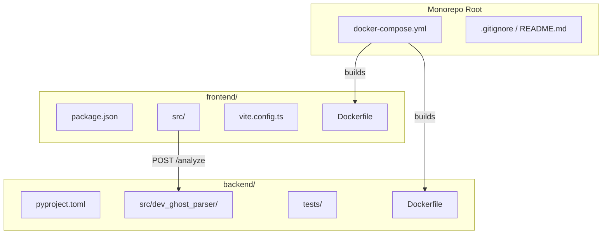
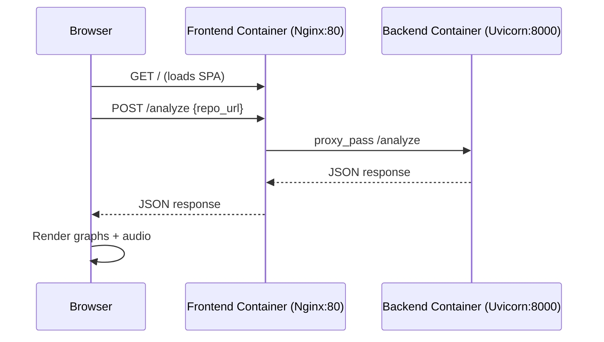

# Design Document: Monorepo Web Layer

## Overview

This design describes the restructuring of DevGhost-Parser into a monorepo with three concerns:

1. **Backend** — The existing Python FastAPI analysis engine relocated to `backend/`, containerized with Docker.
2. **Frontend** — A new React + TypeScript SPA (Vite) in `frontend/` that consumes the analysis API and renders interactive code-flow/ER diagrams with audio narration.
3. **Orchestration** — A `docker-compose.yml` at the repository root wiring both services into a single development/production stack.

The backend remains unchanged in functionality; the frontend is a new consumer that visualizes the JSON output (`codeFlow`, `erModel`, `summary`) already produced by the `POST /analyze` endpoint. Docker orchestration enables one-command startup.

---

## Architecture



### Request Flow (Production)



### Key Architectural Decisions

| Decision | Rationale |
|----------|-----------|
| Vite + React + TypeScript | Fast HMR during development, type safety, widely supported ecosystem |
| `@xyflow/react` for graphs | Purpose-built React library for interactive node-edge diagrams; supports custom nodes and edge labels |
| TailwindCSS for styling | Utility-first approach keeps CSS co-located with components; eliminates dead CSS in production via tree-shaking |
| Nginx reverse proxy in frontend container | Eliminates CORS in production by serving API and SPA from the same origin; caching headers for hashed assets |
| Multi-stage Docker builds | Keeps final images small (no build tools in production image) |
| Health check with `depends_on` | Ensures backend is ready before frontend container starts proxying |

---

## Components and Interfaces

### Backend Components (unchanged)

| Component | Responsibility |
|-----------|---------------|
| `DevGhost_Parser` | Orchestrator — validates path, invokes subsystems, returns JSON bytes |
| `Code_Flow_Analyzer` | Extracts nodes/edges from source files using tree-sitter |
| `ER_Extractor` | Extracts entities/relations from ORM patterns |
| `Summary_Generator` | Produces a plain-text executive summary |
| `Output_Serializer` | Composes the final JSON envelope |
| `server.py` (FastAPI) | HTTP layer — clones repo, calls `DevGhost_Parser.analyze()`, returns JSON |

### Frontend Components (new)

| Component | Props / Inputs | Responsibility |
|-----------|---------------|----------------|
| `App` | — | Root layout; manages global state (loading, response, error) |
| `Header` | `onAnalyze(url)`, `loading` | URL input + "Analyze" button + validation |
| `TabView` | `activeTab`, `onTabChange` | Tabbed container switching between graph views |
| `CodeFlowGraph` | `nodes: Node[]`, `edges: Edge[]` | Renders directed graph via `@xyflow/react` with typed node colors |
| `ERDatabaseGraph` | `entities: Entity[]`, `relations: Relation[]` | Renders ER diagram via `@xyflow/react` with attribute lists |
| `AudioTourPanel` | `summary: string` | Play/Stop narration via Web Speech Synthesis API |
| `ErrorBanner` | `message: string` | Displays API or timeout errors |
| `LoadingIndicator` | — | Spinner/progress shown during analysis |

### Interface: Analysis API Contract

The frontend communicates with a single backend endpoint:

```
POST /analyze
Content-Type: application/json

Request:  { "repo_url": "https://github.com/user/repo" }

Response (success):
{
  "codeFlow": {
    "nodes": [{ "id": "sha1", "label": "UserService", "type": "Service" }, ...],
    "edges": [{ "source": "sha1", "target": "sha2", "relation": "imports" }, ...]
  },
  "erModel": {
    "entities": [{ "name": "User", "attributes": [...], "primaryKey": "id" }, ...],
    "relations": [{ "from": "User", "to": "Post", "type": "one-to-many", "foreignKey": "user_id" }, ...]
  },
  "summary": "This codebase is a REST API with 3 services..."
}

Response (error):
{ "detail": "git clone failed: ..." }
```

### Interface: Docker Compose Service Definitions

```yaml
# docker-compose.yml (schema)
services:
  backend:
    build: ./backend
    ports: ["8000:8000"]
    healthcheck:
      test: ["CMD", "curl", "-f", "http://localhost:8000/"]
      interval: 10s
      timeout: 5s
      retries: 3

  frontend:
    build: ./frontend
    ports: ["5173:80"]
    depends_on:
      backend:
        condition: service_healthy
```

---

## Data Models

### Backend Data Models (existing, unchanged)

These are Python dataclasses defined in `models.py`:

```python
@dataclass
class Node:
    id: str          # SHA-1 of relative path
    label: str       # Class/file name
    type: NodeType   # "Controller" | "Service" | "Route" | "Middleware" | "Repository" | "Utility"

@dataclass
class Edge:
    source: str
    target: str
    relation: EdgeRelation  # "imports" | "calls" | "depends_on"

@dataclass
class Entity:
    name: str
    attributes: list[Attribute]
    primaryKey: str = "id"

@dataclass
class Relation:
    from_entity: str
    to_entity: str
    type: RelationType  # "one-to-one" | "one-to-many" | "many-to-many" | "unknown"
    foreignKey: str
    rawDeclaration: Optional[str] = None
```

### Frontend TypeScript Types (new)

```typescript
// src/types.ts

export type NodeType = "Controller" | "Service" | "Route" | "Middleware" | "Repository" | "Utility";
export type EdgeRelation = "imports" | "calls" | "depends_on";
export type RelationType = "one-to-one" | "one-to-many" | "many-to-many" | "unknown";

export interface CodeFlowNode {
  id: string;
  label: string;
  type: NodeType;
}

export interface CodeFlowEdge {
  source: string;
  target: string;
  relation: EdgeRelation;
}

export interface EntityAttribute {
  name: string;
  type: string;
}

export interface EREntity {
  name: string;
  attributes: EntityAttribute[];
  primaryKey: string;
}

export interface ERRelation {
  from: string;
  to: string;
  type: RelationType;
  foreignKey: string;
  rawDeclaration?: string;
}

export interface AnalysisResponse {
  codeFlow: { nodes: CodeFlowNode[]; edges: CodeFlowEdge[] } | null;
  erModel: { entities: EREntity[]; relations: ERRelation[] } | null;
  summary: string | null;
  errors?: { subsystem: string; message: string }[];
}

export interface AnalysisError {
  detail: string;
}
```

### Frontend Application State

```typescript
interface AppState {
  repoUrl: string;          // Bound to the input field
  loading: boolean;         // True while API request is in-flight
  response: AnalysisResponse | null;  // Successful API response
  error: string | null;     // Error message (from API or timeout)
  activeTab: "codeflow" | "er";      // Currently selected tab
}
```

---

## Correctness Properties

*A property is a characteristic or behavior that should hold true across all valid executions of a system — essentially, a formal statement about what the system should do. Properties serve as the bridge between human-readable specifications and machine-verifiable correctness guarantees.*

### Property 1: URL validation rejects all non-HTTP(S) strings

*For any* string that is either empty, composed entirely of whitespace, or does not begin with `"http://"` or `"https://"`, the URL validation function SHALL return invalid (disabling the Analyze button), and *for any* non-empty string that begins with `"http://"` or `"https://"`, the validation function SHALL return valid.

**Validates: Requirements 3.2**

### Property 2: Distinct node types produce distinct visual indicators

*For any* two `CodeFlowNode` values with different `type` fields, the node-type-to-visual-style mapping function SHALL return different background colors (or icons), ensuring visual distinguishability.

**Validates: Requirements 3.5**

---

## Error Handling

### Frontend Error Scenarios

| Scenario | Trigger | Behavior |
|----------|---------|----------|
| Invalid URL | User enters empty or non-http(s) input | Analyze button disabled; no request sent |
| API 4xx/5xx | Backend returns error response | Display `detail` message in ErrorBanner; re-enable button |
| Network timeout | No response within 130 seconds | Cancel request via `AbortController`; display timeout message; re-enable button |
| Null subsystem data | `codeFlow` or `erModel` is `null` in response | Render informational "no results" message in corresponding tab |
| Speech API unavailable | Browser does not support `speechSynthesis` | Disable Play button; show tooltip explaining feature unavailability |

### Backend Error Scenarios (existing, unchanged)

| Scenario | Trigger | Behavior |
|----------|---------|----------|
| Invalid repo_url | Empty or non-HTTP URL in request body | 422 validation error (Pydantic) |
| Clone failure | Git cannot clone the URL | 400 with `detail` explaining git error |
| Clone timeout | Clone takes >120 seconds | 504 with timeout message |
| Analysis failure | Unexpected error during analysis | 500 with generic message (no internal paths leaked) |

### Docker Error Scenarios

| Scenario | Trigger | Behavior |
|----------|---------|----------|
| Backend unreachable | Frontend proxies to unavailable backend | Nginx returns 502 within 10 seconds |
| Uvicorn crash | Backend process exits | Container exits with non-zero code within 10 seconds |
| Build failure | Dockerfile syntax/dependency error | `docker-compose up` exits non-zero, no services started |
| Health check fail | Backend doesn't respond within retries | Frontend container waits; `depends_on` blocks startup |

---

## Testing Strategy

### Unit Tests (Example-Based)

Unit tests cover specific UI behavior, component rendering, and edge cases using **Vitest** + **React Testing Library** for the frontend:

| Test | What It Verifies |
|------|-----------------|
| Header renders input + button | Component structure (3.1) |
| Submit triggers POST with correct body | API integration (3.3) |
| Tabbed view defaults to Code Flow | UI state (3.4) |
| ER graph renders entities and edges | Component rendering (3.6) |
| Null data shows info message | Edge case handling (3.7) |
| AudioTourPanel play/stop toggles speech | Browser API integration (3.8, 3.9) |
| Error response shows banner | Error display (3.10) |
| Timeout cancels and resets UI | Timeout behavior (3.11) |

### Property-Based Tests

Property-based tests use **fast-check** for the frontend TypeScript code. Each test runs a minimum of 100 iterations.

| Property | Library | What It Tests |
|----------|---------|--------------|
| Property 1: URL validation | fast-check | `isValidUrl(s)` returns correct boolean for all string inputs |
| Property 2: Node type visual mapping | fast-check | `getNodeStyle(type)` returns unique styles for different types |

**Configuration:**
- Library: `fast-check` (TypeScript PBT library)
- Minimum iterations: 100 per property
- Tag format: `Feature: monorepo-web-layer, Property {N}: {title}`

### Integration Tests

Integration tests verify end-to-end behavior with running containers:

| Test | What It Verifies |
|------|-----------------|
| Backend container starts and responds on :8000 | Req 4.4, 4.6 |
| Frontend container serves index.html on :80 | Req 5.3 |
| Frontend proxies /analyze to backend | Req 5.4 |
| Backend unreachable returns 502 | Req 5.6 |
| docker-compose up starts both services | Req 6.2 |
| Backend health check passes | Req 6.7 |

### Smoke Tests

Smoke tests validate structural/configuration correctness without running services:

| Test | What It Verifies |
|------|-----------------|
| backend/ contains src/, tests/, pyproject.toml | Req 1.1 |
| frontend/ builds with zero errors | Req 1.2, 2.5 |
| docker-compose.yml defines both services | Req 1.3, 6.1 |
| No Python files at monorepo root | Req 1.6 |
| package.json has required dependencies | Req 2.1–2.4 |
| Backend Dockerfile uses Python 3.11 | Req 4.1 |
| Frontend Dockerfile has multi-stage build | Req 5.1 |

### Test Tooling Summary

| Layer | Tool | Location |
|-------|------|----------|
| Backend unit/property | pytest + hypothesis | `backend/tests/` |
| Frontend unit | Vitest + React Testing Library | `frontend/src/**/*.test.ts(x)` |
| Frontend property | fast-check + Vitest | `frontend/src/**/*.property.test.ts` |
| Integration | docker-compose + shell scripts | `tests/integration/` or CI pipeline |
| Smoke | Static checks / scripts | CI pipeline |

