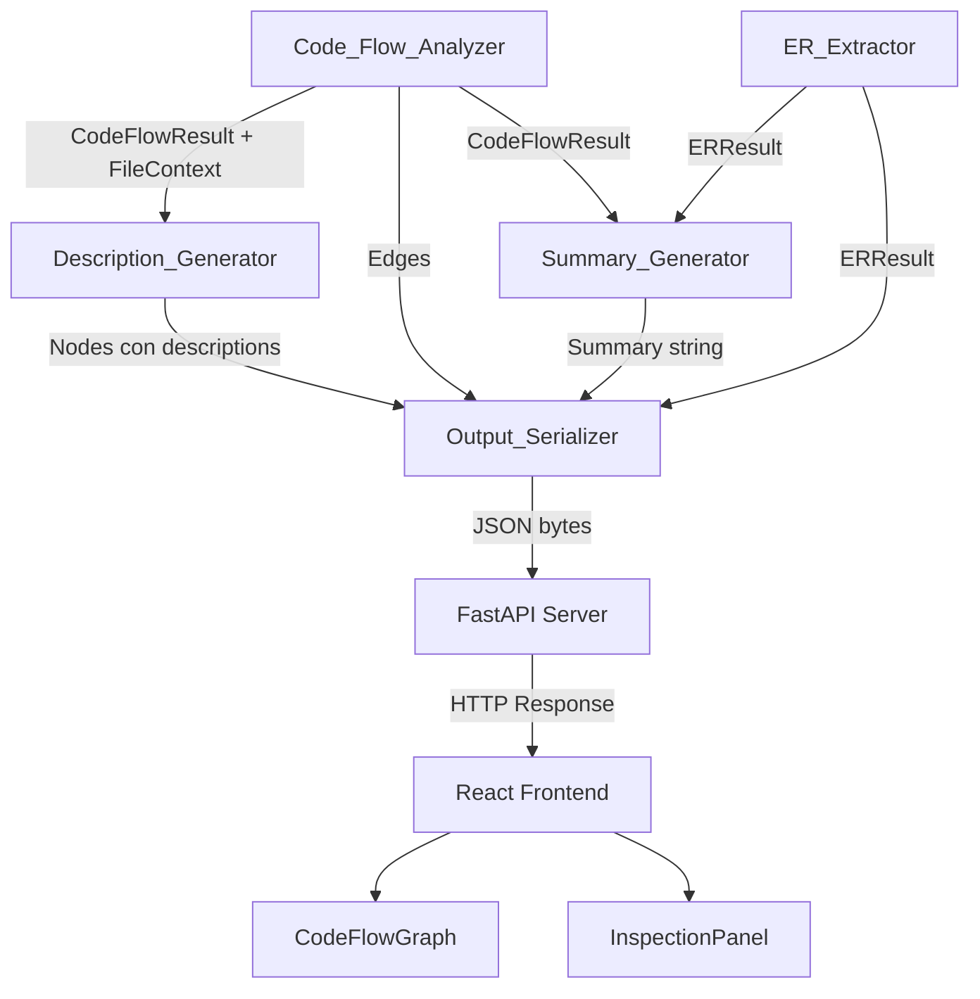
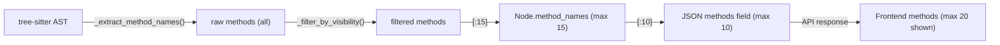

# Design Document: Precision Analysis Enhancements

## Overview

Este diseño aborda las mejoras de precisión en DevGhost-Parser para: (1) clasificar correctamente archivos de configuración con un nuevo NodeType "Config", (2) extraer métodos reales desde el AST con tree-sitter incluyendo reglas de visibilidad por lenguaje, (3) generar descripciones basadas en métodos reales en lugar de texto genérico, (4) exponer la lista de métodos en la API y el frontend, y (5) inferir el dominio de negocio del proyecto en el resumen global.

Las modificaciones se distribuyen entre 4 módulos backend (`models.py`, `code_flow_analyzer.py`, `description_generator.py`, `summary_generator.py`, `output_serializer.py`) y 3 componentes frontend (`types.ts`, `CodeFlowGraph.tsx`, `InspectionPanel.tsx`).

## Architecture

La arquitectura existente sigue un patrón pipeline donde el `Code_Flow_Analyzer` produce nodos y aristas, el `Description_Generator` enriquece nodos con descripciones, el `Summary_Generator` produce un resumen global, y el `Output_Serializer` compone la respuesta JSON final. El frontend consume esta respuesta y renderiza grafos interactivos.



Las mejoras se integran dentro de este pipeline existente sin cambiar la interfaz entre componentes, solo extendiendo los datos que fluyen:

1. **models.py**: Se añade "Config" al `NodeType` Literal y un campo `method_names` al `Node` dataclass.
2. **code_flow_analyzer.py**: Se añaden reglas de clasificación para Config con prioridad correcta, se implementa filtrado de métodos privados/dunder, y se aplica el cap de 15 métodos.
3. **description_generator.py**: Se añade soporte para NodeType "Config" en fallbacks y prefixes, y se implementa la lógica de descripción cuando no hay match en PURPOSE_MAP.
4. **summary_generator.py**: Se añade el mapa de palabras clave de dominio y la lógica de inferencia.
5. **output_serializer.py**: Se incluye el campo "methods" en la serialización de nodos, con cap de 10.
6. **Frontend**: Se actualiza `types.ts`, `CodeFlowGraph.tsx` y `InspectionPanel.tsx`.

## Components and Interfaces

### Backend

#### 1. `models.py` — Extensiones al Modelo de Datos

```python
# NodeType ahora incluye "Config"
NodeType = Literal[
    "Controller", "Service", "Route", "Middleware", 
    "Repository", "Utility", "Config"
]

@dataclass
class Node:
    id: str
    label: str
    type: NodeType
    description: str = ""
    method_names: list[str] = field(default_factory=list)  # NEW
```

#### 2. `code_flow_analyzer.py` — Clasificación y Extracción

**Nuevas constantes de clasificación:**
```python
_CONFIG_PATTERNS: list[str] = [
    "config", "configuration", "connection", 
    "database", "appconfig", "dbconfig", "settings"
]

_INIT_PATTERNS: list[str] = [
    "init", "bootstrap", "setup", "startup"
]
```

**Nueva función `_classify_for_file` mejorada:**
- Evalúa Config patterns ANTES que Route.
- Prioriza "Config" sobre todo excepto "Controller".
- Si nombre coincide con Config + Init simultáneamente, asigna "Config".

**Filtrado de métodos por visibilidad:**
```python
def _filter_methods_by_visibility(methods: list[str], ext: str) -> list[str]:
    """Filtra métodos según reglas de visibilidad del lenguaje."""
    if ext == ".py":
        return [m for m in methods if not m.startswith("__")]
    elif ext in (".java", ".ts", ".tsx", ".cs"):
        # Excluir private/protected (requiere info del AST)
        return _filter_java_ts_cs_visibility(methods, ...)
    else:  # .go, .rs, .rb — sin filtrado
        return methods
```

**Cap de 15 métodos:**
```python
method_names = _filter_methods_by_visibility(raw_methods, ext)[:15]
```

#### 3. `description_generator.py` — Generación de Descripciones

**Nuevas entradas en constantes:**
```python
_GENERIC_FALLBACKS["Config"] = "Configuración del sistema"
_TYPE_PREFIXES["Config"] = "Configuración que define"
```

**Nueva lógica para Config con inferencia de dominio desde label:**
```python
def _config_description(self, node: Node) -> str:
    label_lower = node.label.lower()
    domain_map = {"database": "base de datos", "redis": "Redis", "auth": "autenticación", ...}
    for key, domain in domain_map.items():
        if key in label_lower:
            return f"Configuración de {domain}"
    return "Configuración del sistema"
```

**Nueva lógica cuando no hay match en PURPOSE_MAP:**
```python
def _from_methods_no_match(self, node: Node, method_names: list[str]) -> str:
    """Lista hasta 3 métodos directamente cuando no hay match en PURPOSE_MAP."""
    prefix = _TYPE_PREFIXES.get(node.type, "Componente que gestiona")
    limited = method_names[:3]
    if len(limited) == 1:
        return f"{prefix} {limited[0]}"
    elif len(limited) == 2:
        return f"{prefix} {limited[0]} y {limited[1]}"
    else:
        return f"{prefix} {limited[0]}, {limited[1]} y {limited[2]}"
```

#### 4. `summary_generator.py` — Inferencia de Dominio

**Nuevo mapa de palabras clave de dominio (≥15 entradas):**
```python
_DOMAIN_KEYWORD_MAP: dict[str, str] = {
    "asistencia": "control de asistencia",
    "producto": "gestión de inventario",
    "factura": "facturación",
    "usuario": "gestión de usuarios",
    "orden": "gestión de pedidos",
    "paciente": "gestión hospitalaria",
    "alumno": "gestión educativa",
    "empleado": "gestión de recursos humanos",
    "vehiculo": "gestión de flota vehicular",
    "reserva": "gestión de reservas",
    "pago": "procesamiento de pagos",
    "cuenta": "gestión financiera",
    "inventario": "control de inventario",
    "ticket": "gestión de soporte",
    "proyecto": "gestión de proyectos",
    "cliente": "gestión de clientes",
    "venta": "gestión de ventas",
    "compra": "gestión de compras",
    "envio": "logística de envíos",
    "curso": "gestión educativa",
}
```

**Lógica de inferencia:**
```python
def _infer_domain(self, entities: list[Entity], labels: list[str]) -> str | None:
    """Infiere dominio de negocio comparando entidades/labels contra keyword map."""
    domain_counts: dict[str, int] = {}
    domain_first_pos: dict[str, int] = {}
    
    all_names = [e.name for e in entities] + labels
    
    for idx, name in enumerate(all_names):
        name_lower = name.lower()
        for keyword, domain in _DOMAIN_KEYWORD_MAP.items():
            if keyword in name_lower or name_lower in keyword:
                domain_counts[domain] = domain_counts.get(domain, 0) + 1
                if domain not in domain_first_pos:
                    domain_first_pos[domain] = idx
    
    if not domain_counts:
        return None
    
    # Seleccionar dominio con mayor count; tie-break por primera aparición
    max_count = max(domain_counts.values())
    candidates = [d for d, c in domain_counts.items() if c == max_count]
    candidates.sort(key=lambda d: domain_first_pos[d])
    return candidates[0]
```

#### 5. `output_serializer.py` — Campo "methods" en JSON

```python
def _code_flow_to_dict(code_flow: CodeFlowResult) -> dict:
    return {
        "nodes": [
            {
                "id": node.id,
                "label": node.label,
                "type": node.type,
                "description": node.description,
                "methods": node.method_names[:10],  # Cap a 10 para la API
            }
            for node in code_flow.nodes
        ],
        "edges": [...],
    }
```

### Frontend

#### 6. `types.ts` — Extensión de tipos

```typescript
export type NodeType = "Controller" | "Service" | "Route" | "Middleware" 
                     | "Repository" | "Utility" | "Config";

export interface CodeFlowNode {
  id: string;
  label: string;
  type: NodeType;
  description: string;
  methods?: string[];  // NEW
}
```

#### 7. `CodeFlowGraph.tsx` — Renderizado de Config

```typescript
// En getNodeStyle:
case 'Config':
  return { backgroundColor: '#9333ea' };  // Purple-600, exclusivo

// En getNodeIcon:
case 'Config':
  return '⚙️';  // Distinto de Service (que usa ⚙️ actualmente → cambiar Service a 🔄)
  // Alternativa: usar '📋' para Config

// En getNodeTypeLabel:
case 'Config':
  return 'CONFIG';

// En getNodeRank:
case 'Config':
  return 6;  // Último en orden de filtros
```

#### 8. `InspectionPanel.tsx` — Sección de Métodos

Nueva sección entre la descripción y las dependencias:

```tsx
{/* Methods Section */}
{selectedNode.methods && selectedNode.methods.length > 0 && (
  <div className="px-4 py-4 border-b border-gray-100">
    <h5 className="text-xs font-semibold text-gray-700 uppercase tracking-wide mb-2">
      Métodos / Funciones clave
    </h5>
    <ul className="space-y-1">
      {selectedNode.methods.slice(0, 20).map((method, idx) => (
        <li key={idx} className="text-xs text-gray-700 font-mono">
          ƒ {method.length > 40 ? method.slice(0, 37) + '...' : method}
        </li>
      ))}
    </ul>
    {selectedNode.methods.length > 20 && (
      <p className="text-[10px] text-gray-400 mt-1 italic">
        +{selectedNode.methods.length - 20} métodos adicionales
      </p>
    )}
  </div>
)}
```

## Data Models

### Cambios en Node (Backend)

| Campo | Tipo | Descripción | Cambio |
|-------|------|-------------|--------|
| `id` | `str` | SHA-1 del path relativo | Sin cambio |
| `label` | `str` | Nombre de clase o stem | Sin cambio |
| `type` | `NodeType` | Categoría arquitectónica | Incluye "Config" |
| `description` | `str` | Descripción ≤120 chars | Sin cambio |
| `method_names` | `list[str]` | Métodos extraídos (max 15) | **NUEVO** |

### Cambios en CodeFlowNode (Frontend)

| Campo | Tipo | Descripción | Cambio |
|-------|------|-------------|--------|
| `id` | `string` | Identificador único | Sin cambio |
| `label` | `string` | Etiqueta del nodo | Sin cambio |
| `type` | `NodeType` | Tipo arquitectónico | Incluye "Config" |
| `description` | `string` | Descripción del nodo | Sin cambio |
| `methods` | `string[]` | Métodos clave (max 10) | **NUEVO** |

### Mapa de Dominio (Summary_Generator)

```
Estructura: dict[str, str]
  key: palabra clave de dominio (lowercase)
  value: propósito de negocio en español
  Mínimo: 15 entradas
```

### Flujo de Datos del Campo `method_names`



## Correctness Properties

*A property is a characteristic or behavior that should hold true across all valid executions of a system—essentially, a formal statement about what the system should do. Properties serve as the bridge between human-readable specifications and machine-verifiable correctness guarantees.*

### Property 1: Config Classification Correctness

*For any* filename or class_name (case-insensitive) containing any of the substrings "config", "configuration", "connection", "database", "appconfig", "dbconfig", or "settings", the classification function SHALL return NodeType "Config". Similarly, *for any* filename containing "init", "bootstrap", "setup", or "startup" (without config substrings), the classification SHALL return "Utility".

**Validates: Requirements 1.1, 1.2**

### Property 2: Classification Priority — Config Over Others Except Controller

*For any* filename that matches both a Config pattern and any other non-Controller pattern (Route, Service, Middleware, Repository, Utility), the classification function SHALL assign "Config". *For any* filename matching both Config and Controller patterns, the classification SHALL assign "Controller". *For any* filename matching both Config and Init patterns, the classification SHALL assign "Config".

**Validates: Requirements 1.3, 1.4, 1.5**

### Property 3: Method Extraction Produces Ordered List Capped at 15

*For any* source file with a supported extension that parses successfully, the extracted method_names list SHALL contain methods in their order of appearance in the source code and SHALL never exceed 15 elements.

**Validates: Requirements 2.1, 2.4**

### Property 4: Private/Dunder Method Exclusion

*For any* Python source file, method names starting with double underscore SHALL NOT appear in the extracted method_names. *For any* Java/TypeScript/C# source file, methods with private or protected visibility SHALL NOT appear in the extracted method_names. *For any* Go, Rust, or Ruby source file, ALL defined functions and methods SHALL appear without visibility filtering.

**Validates: Requirements 2.2, 2.5**

### Property 5: Graceful Fallback for Unsupported Files

*For any* file with an extension NOT in the supported grammar map, or *for any* file whose parsing raises an exception, the extracted method_names SHALL be an empty list and no fatal error SHALL be raised.

**Validates: Requirements 2.3**

### Property 6: Description From Methods Uses Purpose Map or Direct Listing

*For any* Node with a FileContext containing method_names where at least one normalized name matches a keyword in METHOD_PURPOSE_MAP, the generated description SHALL contain the NodeType prefix followed by at least one (and at most 3) inferred purpose strings from the map. *For any* Node with method_names where NO name matches the map, the description SHALL list up to 3 method names directly with the NodeType prefix.

**Validates: Requirements 3.1, 3.2, 3.5**

### Property 7: Description Invariant (Including Config)

*For any* valid Node (with any NodeType including "Config") and any FileContext (or None), the Description_Generator SHALL return a non-empty string of at most 120 Unicode characters. If the generated text exceeds 120 characters, it SHALL be truncated to 117 characters followed by "...".

**Validates: Requirements 3.4, 3.6**

### Property 8: Config Description Template

*For any* Node with type "Config" and a FileContext that is None or has empty method_names and empty imports, the Description_Generator SHALL return a description starting with "Configuración". When the node label contains a recognizable domain substring (e.g., "database", "redis", "auth"), the description SHALL include that domain context.

**Validates: Requirements 3.3**

### Property 9: Serialization Includes Methods Field Capped at 10

*For any* CodeFlowResult, the serialized JSON SHALL include a "methods" field (array of strings) in every node object under codeFlow.nodes. This array SHALL contain at most 10 elements preserving source order, and SHALL be an empty array `[]` when the node has no extracted methods.

**Validates: Requirements 4.1, 4.2, 4.3**

### Property 10: Domain Inference Correctness

*For any* set of ER entities and node labels, the Summary_Generator's domain inference SHALL select the domain from the keyword map that has the highest number of case-insensitive substring matches. When multiple domains tie in match count, it SHALL select the domain whose first matching entity/label appears earliest in the entity list order.

**Validates: Requirements 6.1, 6.2, 6.3**

### Property 11: Summary Invariant With Domain Inference

*For any* combination of CodeFlowResult and ERResult (including cases where domain inference produces a match), the generated summary SHALL never exceed 500 Unicode code points and SHALL contain at most 4 sentences.

**Validates: Requirements 6.6**

### Property 12: Method Display Name Truncation

*For any* method name string, the display formatting function SHALL prepend "ƒ " and, when the method name exceeds 40 characters, SHALL truncate to the first 37 characters followed by "...".

**Validates: Requirements 5.3**

## Error Handling

| Escenario | Componente | Comportamiento |
|-----------|-----------|----------------|
| tree-sitter no puede parsear un archivo | Code_Flow_Analyzer | `method_names = []`, nodo se crea normalmente, error no-fatal registrado |
| Extensión no soportada por tree-sitter | Code_Flow_Analyzer | `method_names = []`, fallback a clasificación por nombre de archivo |
| Grammar ABI incompatible | Code_Flow_Analyzer | Parser no se crea para esa extensión, archivos con esa extensión usan regex fallback para imports y `[]` para métodos |
| Archivo no legible (permisos) | Code_Flow_Analyzer | Error no-fatal registrado, nodo creado con label basado en filename, `method_names = []` |
| Nombre no coincide con ningún patrón de clasificación | Code_Flow_Analyzer | Asigna "Utility" como fallback (comportamiento existente) |
| FileContext None o vacío | Description_Generator | Retorna fallback genérico del NodeType, nunca cadena vacía |
| Descripción excede 120 caracteres | Description_Generator | Trunca a 117 + "..." |
| Dominio no inferido del mapa de keywords | Summary_Generator | Mantiene oración genérica de propósito sin modificación |
| Resumen excedería 500 code points con oración de dominio | Summary_Generator | Omite la oración de dominio para respetar el límite |
| Campo "methods" undefined en respuesta API (backward compat) | InspectionPanel (Frontend) | Oculta sección "Métodos / Funciones clave" completamente |
| NodeType "Config" no reconocido por frontend legacy | CodeFlowGraph | Se añade case en todos los switch statements; si falta, TypeScript emitirá error de exhaustividad |

## Testing Strategy

### Property-Based Tests (Hypothesis)

Se utilizará la librería **Hypothesis** (ya instalada como dependencia dev) para implementar los 12 correctness properties definidos arriba. Cada test se ejecutará con un mínimo de **100 iteraciones**.

**Tagging format:** Cada test incluirá un comentario de la forma:
```
# Feature: precision-analysis-enhancements, Property N: [título]
```

**Tests a implementar:**

1. `test_property_config_classification.py` — Property 1: Config classification correctness
2. `test_property_classification_priority.py` — Property 2: Priority rules
3. `test_property_method_extraction_order_cap.py` — Property 3: Ordered list capped at 15
4. `test_property_method_visibility_filter.py` — Property 4: Private/dunder exclusion
5. `test_property_unsupported_file_fallback.py` — Property 5: Graceful fallback
6. `test_property_description_from_methods.py` — Property 6: Purpose map / direct listing
7. `test_property_description_invariant_config.py` — Property 7: Description invariant with Config
8. `test_property_config_description_template.py` — Property 8: Config description template
9. `test_property_serialization_methods.py` — Property 9: Methods field in serialization
10. `test_property_domain_inference.py` — Property 10: Domain inference correctness
11. `test_property_summary_invariant_domain.py` — Property 11: Summary with domain ≤500cp, ≤4 sentences
12. `test_property_method_display_truncation.py` — Property 12: Method display truncation

### Unit Tests (pytest)

Tests de ejemplo específicos para escenarios concretos:

- Clasificación de archivos con nombres como "DatabaseConfig.py", "AppSettings.ts"
- InspectionPanel rendering con métodos presentes/ausentes (vitest + React Testing Library)
- CodeFlowGraph filter bar con nodos Config (vitest)
- Serialización de nodo Config con 0, 5, 15 métodos
- Summary con entidades que matchean exactamente un dominio vs. ninguno

### Integration Tests

- Análisis end-to-end de un directorio con archivos de configuración → verificar nodos Config en la respuesta
- API response schema validation con campo "methods" presente

### Balance de Testing

- **Property tests**: Cubren invariantes universales (clasificación, descripción, serialización, summary)
- **Unit tests**: Cubren ejemplos específicos, edge cases (nombres ambiguos, collisions), y comportamiento de UI components
- **Integration tests**: Verifican el pipeline completo funciona correctamente con los cambios integrados
