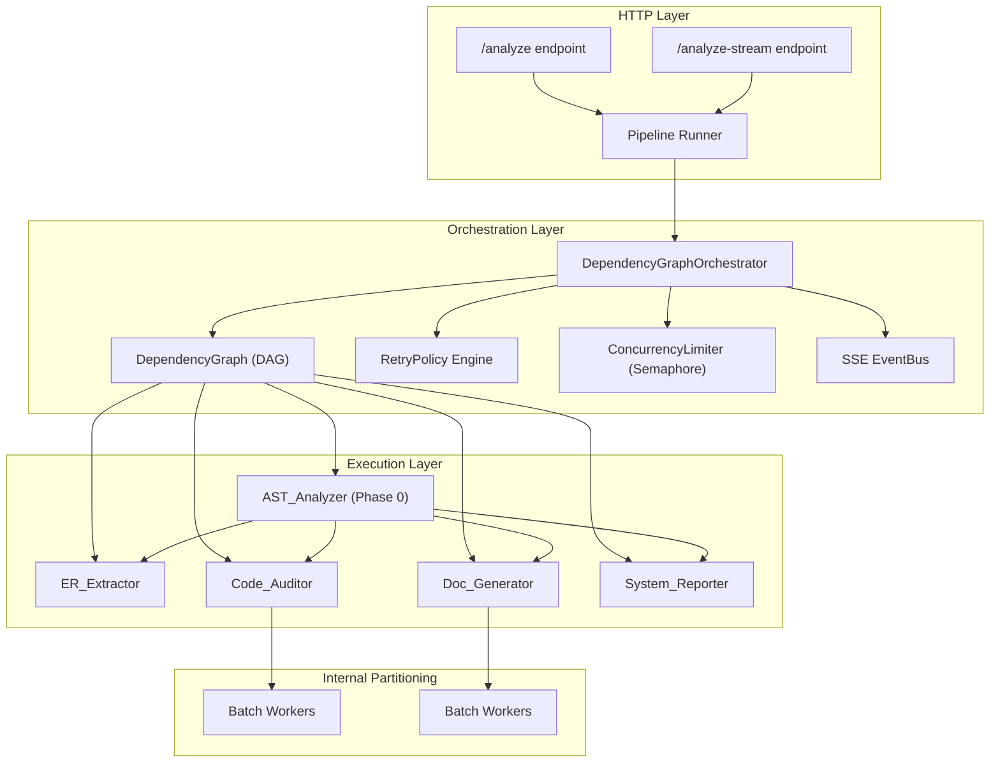
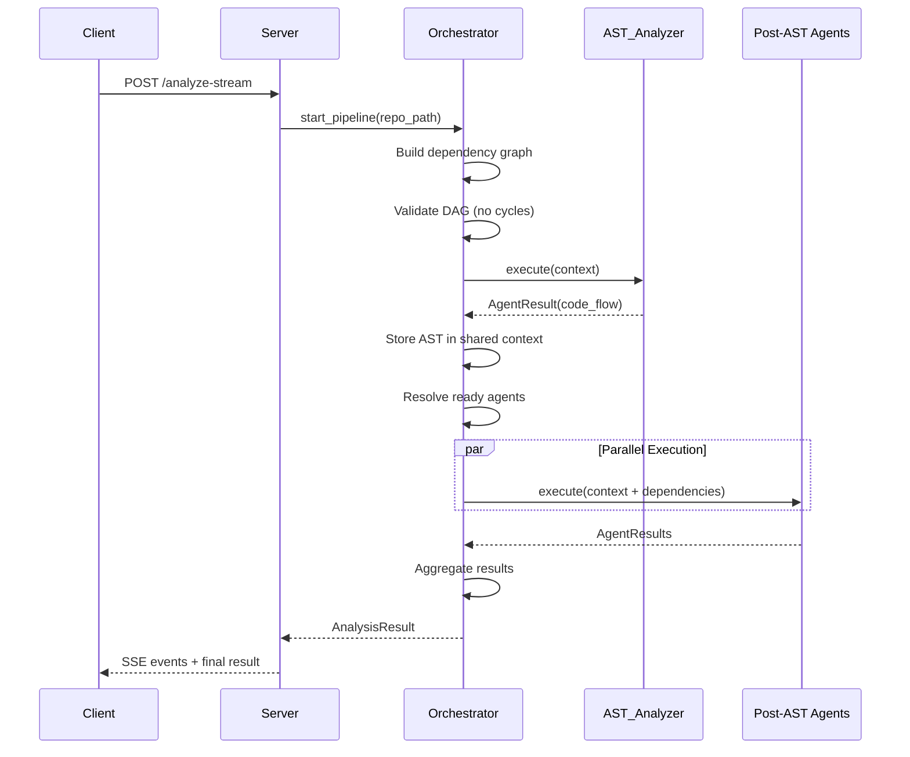

# Design Document: Sub-Agent Parallel Analysis

## Overview

This design enhances the DevGhost-Parser backend to replace the current flat-parallel orchestration with a **dependency-graph-aware execution engine**. The existing `AgentOrchestrator` runs all agents simultaneously without regard for data dependencies between them. The new architecture introduces:

1. **Foundational AST phase**: The `ast_analyzer` executes first as a mandatory prerequisite, providing shared context for all downstream agents.
2. **DAG-based execution**: Post-AST agents declare explicit dependencies; the orchestrator resolves execution order via topological sort.
3. **Retry with exponential backoff**: Transient failures are handled with configurable per-agent retry policies.
4. **Work partitioning**: Individual agents can split large file sets into parallel batches with internal concurrency control.
5. **Granular SSE progress**: Events now include sequence numbers; batch-level progress is forwarded in real time.
6. **Individual timeouts**: Each agent has a configurable timeout, separate from the global pipeline timeout.
7. **Precise result aggregation**: Merging guarantees no data loss from successful agents, annotates partial results, and records comprehensive metadata.

The existing `/analyze` and `/analyze-stream` endpoints retain their external JSON schema and SSE event types, ensuring full backward compatibility.

### Design Rationale

The current orchestrator (in `orchestrator.py`) uses `asyncio.TaskGroup` to launch all agents concurrently. This is fast but flawed:
- The `code_auditor` and `doc_generator` need AST results as input context; running them before AST completes wastes resources and produces less accurate results.
- A single failure has no retry mechanism — the agent is simply marked failed.
- No way to express that `er_extractor` could benefit from AST context for cross-referencing.

A DAG-based approach enables maximum parallelism while ensuring correctness: agents only launch when their actual dependencies have resolved.

## Architecture



### Execution Flow



## Components and Interfaces

### 1. DependencyGraph

Responsible for modeling agent dependencies as a directed acyclic graph and computing execution order.

```python
class DependencyGraph:
    """DAG structure for managing agent execution order."""

    def __init__(self) -> None:
        self._adjacency: dict[str, set[str]] = {}  # agent -> set of dependents
        self._in_degree: dict[str, int] = {}        # agent -> number of unresolved deps

    def add_agent(self, name: str, dependencies: list[str]) -> None:
        """Register an agent with its declared dependencies."""
        ...

    def validate(self) -> None:
        """Raise CyclicDependencyError if graph contains a cycle."""
        ...

    def get_ready_agents(self, completed: set[str]) -> list[str]:
        """Return agents whose dependencies are all resolved."""
        ...

    def mark_completed(self, name: str) -> None:
        """Mark an agent as completed, updating in-degrees."""
        ...

    def mark_failed(self, name: str) -> list[str]:
        """Mark agent as failed; return all transitively dependent agents."""
        ...
```

### 2. RetryPolicy

Encapsulates retry configuration with exponential backoff logic.

```python
@dataclass
class RetryPolicy:
    """Configuration for retry behavior of a sub-agent."""

    max_retries: int = 2
    base_delay_seconds: float = 1.0
    multiplier: float = 2.0

    def get_delay(self, attempt: int) -> float:
        """Calculate delay for the given attempt number (0-indexed)."""
        return self.base_delay_seconds * (self.multiplier ** attempt)
```

### 3. Enhanced BaseAgent Interface

Extends the existing `BaseAgent` with dependency declaration, timeout, and retry configuration.

```python
class BaseAgent(ABC):
    """Enhanced base class with dependency and timeout support."""

    name: str
    description: str

    @property
    def dependencies(self) -> list[str]:
        """Agent names this agent depends on (beyond implicit AST).
        Override to declare explicit dependencies. Default: empty list."""
        return []

    @property
    def timeout_seconds(self) -> float:
        """Individual timeout for this agent. Default: 60s."""
        return 60.0

    @property
    def retry_policy(self) -> RetryPolicy:
        """Retry configuration for this agent. Default: 2 retries, 1s base."""
        return RetryPolicy()

    @abstractmethod
    async def execute(self, context: AgentContext) -> AgentResult:
        """Execute analysis. Context includes resolved dependency results."""
        ...
```

### 4. Enhanced AgentContext

Extends context to carry resolved dependency results.

```python
@dataclass
class AgentContext:
    """Shared execution context with dependency results."""

    repo_path: str
    llm_client: LLM_Client
    event_queue: asyncio.Queue[AgentEvent]
    dependency_results: dict[str, AgentResult] = field(default_factory=dict)
    # Key: agent name, Value: AgentResult from that agent
```

### 5. DependencyGraphOrchestrator

The new orchestrator that replaces the flat-parallel approach.

```python
class DependencyGraphOrchestrator:
    """DAG-aware orchestrator with retry, timeout, and partitioning support."""

    def __init__(
        self,
        repo_path: str,
        llm_client: LLM_Client,
        event_queue: asyncio.Queue[AgentEvent],
        max_concurrency: int = 5,
        global_timeout_seconds: float = 300.0,
    ) -> None: ...

    def register_agent(self, agent: BaseAgent) -> None: ...

    async def run_pipeline(self) -> AnalysisResult:
        """Execute full pipeline: AST phase → DAG-resolved parallel phase."""
        ...

    async def _execute_foundational_phase(self) -> AgentResult:
        """Run AST analyzer with retry. Abort pipeline on failure."""
        ...

    async def _execute_parallel_phase(
        self, ast_result: AgentResult
    ) -> list[AgentResult]:
        """Execute remaining agents respecting the dependency graph."""
        ...

    async def _run_agent_with_retry(
        self, agent: BaseAgent, context: AgentContext
    ) -> AgentResult:
        """Execute agent with timeout and retry policy."""
        ...
```

### 6. WorkPartitioner (Mixin)

A mixin or utility that agents can use to split file processing into batches.

```python
class WorkPartitioner:
    """Utility for splitting file sets into parallel batches."""

    def __init__(
        self,
        batch_size: int = 20,
        file_threshold: int = 50,
        max_batch_concurrency: int = 5,
    ) -> None: ...

    def should_partition(self, file_count: int) -> bool:
        """Return True if file count exceeds threshold."""
        return file_count > self.file_threshold

    def create_batches(self, files: list[str]) -> list[list[str]]:
        """Split files into batches of configured size."""
        ...

    async def process_batches(
        self,
        batches: list[list[str]],
        processor: Callable[[list[str]], Awaitable[Any]],
        progress_callback: Callable[[int, int], Awaitable[None]],
    ) -> list[BatchResult]:
        """Process all batches concurrently with progress reporting."""
        ...
```

### 7. Enhanced SSE Event Model

Events gain a monotonically increasing sequence number.

```python
@dataclass
class AgentEvent:
    type: AgentEventType
    agent: AgentIdentifier
    message: str
    timestamp: str
    sequence: int  # NEW: monotonically increasing sequence number
    duration_ms: Optional[int] = None
    result: Optional[dict[str, Any]] = None
    error: Optional[str] = None
    progress_pct: Optional[float] = None  # NEW: 0.0 - 100.0
    retry_count: Optional[int] = None  # NEW: number of retries attempted
```

### 8. Enhanced AnalysisResult

Extends the result with execution metadata.

```python
@dataclass
class AnalysisResult:
    code_flow: Optional[dict] = None
    er_model: Optional[dict] = None
    audit: Optional[dict] = None
    artifacts: Optional[dict] = None
    system_report: Optional[dict] = None
    node_inspections: Optional[dict] = None
    errors: list[dict] = field(default_factory=list)
    metadata: Optional[ExecutionMetadata] = None  # NEW

@dataclass
class ExecutionMetadata:
    """Pipeline execution statistics."""
    total_duration_ms: int
    agent_durations: dict[str, int]  # agent_name -> duration_ms
    retry_counts: dict[str, int]     # agent_name -> retries used
    failed_agents: list[str]
    partial_results: list[str]       # agents with partial results
```

## Data Models

### DependencyGraph Internal State

```python
# Adjacency list representation
_adjacency: dict[str, set[str]] = {
    "ast_analyzer": {"er_extractor", "code_auditor", "doc_generator", "system_reporter"},
    "er_extractor": set(),
    "code_auditor": set(),
    "doc_generator": set(),
    "system_reporter": set(),
}

# In-degree tracking (number of unresolved dependencies)
_in_degree: dict[str, int] = {
    "ast_analyzer": 0,
    "er_extractor": 1,  # depends on ast_analyzer
    "code_auditor": 1,  # depends on ast_analyzer
    "doc_generator": 1, # depends on ast_analyzer
    "system_reporter": 1, # depends on ast_analyzer
}
```

### RetryPolicy Configuration Per Agent

| Agent | max_retries | base_delay_seconds | multiplier | timeout_seconds |
|-------|-------------|-------------------|------------|-----------------|
| ast_analyzer | 2 | 1.0 | 2.0 | 90 |
| er_extractor | 2 | 1.0 | 2.0 | 60 |
| code_auditor | 2 | 1.5 | 2.0 | 120 |
| doc_generator | 2 | 1.0 | 2.0 | 90 |
| system_reporter | 1 | 0.5 | 2.0 | 30 |

### BatchResult

```python
@dataclass
class BatchResult:
    """Result from processing a single batch within a partition."""
    batch_index: int
    total_batches: int
    success: bool
    data: Any = None
    error: Optional[str] = None
    files_processed: int = 0
```

### SSE Event Wire Format (Backward Compatible)

```json
{
    "type": "agent_progress",
    "agent": "code_auditor",
    "message": "Processing batch 3/5",
    "timestamp": "2024-01-15T10:30:00.123Z",
    "sequence": 14,
    "progress_pct": 60.0,
    "retry_count": 0
}
```

The existing fields (`type`, `agent`, `message`, `timestamp`, `duration_ms`, `result`, `error`) remain unchanged. New fields (`sequence`, `progress_pct`, `retry_count`) are additive — existing frontends that don't read them are unaffected.

### Conflict Resolution Strategy

When multiple agents produce data for the same field (unlikely in current design but supported for future extensibility):

```python
AGENT_PRIORITY: dict[str, int] = {
    "ast_analyzer": 100,      # Highest priority (foundational)
    "er_extractor": 80,
    "code_auditor": 60,
    "doc_generator": 40,
    "system_reporter": 20,    # Lowest priority
}
```

Last-writer-wins based on priority: higher priority agent's data takes precedence.


## Correctness Properties

*A property is a characteristic or behavior that should hold true across all valid executions of a system — essentially, a formal statement about what the system should do. Properties serve as the bridge between human-readable specifications and machine-verifiable correctness guarantees.*

### Property 1: DAG Cycle Detection

*For any* directed graph of agent dependencies, the `DependencyGraph.validate()` method SHALL correctly identify whether the graph contains a cycle: returning no error for valid DAGs and raising `CyclicDependencyError` for graphs with cycles.

**Validates: Requirements 2.2**

### Property 2: Ready-Set Computation

*For any* valid DAG and any set of completed agent names, `get_ready_agents(completed)` SHALL return exactly the set of agents whose declared dependencies are all contained within the completed set.

**Validates: Requirements 2.3, 3.2**

### Property 3: Transitive Failure Propagation

*For any* valid DAG, when an agent is marked as failed via `mark_failed(name)`, all agents transitively reachable from the failed agent in the dependency direction SHALL be returned as skipped, and no agent that is NOT transitively dependent SHALL be affected.

**Validates: Requirements 3.4**

### Property 4: AST Context Propagation

*For any* set of downstream agents and a successful AST result, when the orchestrator passes context to each downstream agent, every downstream agent's `context.dependency_results` SHALL contain the full AST `AgentResult` data.

**Validates: Requirements 1.2, 1.4, 3.3**

### Property 5: AST Failure Aborts Pipeline

*For any* retry policy configuration, if the AST_Analyzer fails on every attempt (initial + retries), the orchestrator SHALL execute zero downstream agents and return a pipeline error.

**Validates: Requirements 1.3, 4.4**

### Property 6: Retry Count Adherence

*For any* `RetryPolicy` with `max_retries = N`, when an agent fails on every execution, the total number of execution attempts SHALL equal exactly `N + 1` (one initial attempt plus N retries), and the final state SHALL be marked as failed with an error event emitted.

**Validates: Requirements 4.1, 4.3**

### Property 7: Exponential Backoff Delay Computation

*For any* `RetryPolicy` with `base_delay_seconds = B` and `multiplier = M`, the delay before retry attempt `i` (0-indexed) SHALL equal `B * M^i`.

**Validates: Requirements 4.2**

### Property 8: Work Partitioning Threshold

*For any* file count `N` and configured threshold `T`, `should_partition(N)` SHALL return `True` if and only if `N > T`. When partitioning occurs with batch size `S`, the resulting batches SHALL cover all `N` files with no file omitted and no file duplicated.

**Validates: Requirements 5.1**

### Property 9: Batch Merge Preserves Data and Annotates Failures

*For any* list of `BatchResult` objects where some succeed and some fail, merging them SHALL produce a result that contains all data from successful batches and error annotations for each failed batch, with no successful batch data lost.

**Validates: Requirements 5.3, 5.4**

### Property 10: SSE Sequence Monotonicity

*For any* sequence of `AgentEvent` objects emitted during a pipeline execution, the `sequence` field SHALL be strictly monotonically increasing (each event's sequence > previous event's sequence).

**Validates: Requirements 6.5, 1.5**

### Property 11: SSE Error Message Truncation

*For any* error message string of any length, when emitted as an `agent_error` event, the `error` field SHALL be truncated to at most 1024 characters while the `retry_count` field accurately reflects the number of retries attempted.

**Validates: Requirements 6.4**

### Property 12: Result Merge Preserves All Successful Agent Data

*For any* set of `AgentResult` objects where `success=True`, merging them into an `AnalysisResult` SHALL produce an output where every data field from each successful agent is present and unmodified in the corresponding `AnalysisResult` field.

**Validates: Requirements 8.1, 8.3**

### Property 13: Priority-Based Conflict Resolution

*For any* two agents producing data for the same field with different priorities, the merged `AnalysisResult` SHALL contain the data from the higher-priority agent, and a conflict warning SHALL be logged.

**Validates: Requirements 8.4**

### Property 14: Concurrency Limit Enforcement

*For any* configured concurrency limit `C` and any execution trace of agents through the orchestrator, the number of simultaneously executing agents at any point in time SHALL never exceed `C`.

**Validates: Requirements 2.5**

### Property 15: Timeout Triggers Cancellation and Retry

*For any* agent with `timeout_seconds = T`, if the agent's execution duration exceeds `T`, the execution SHALL be cancelled and the retry policy SHALL be applied (retrying up to `max_retries` times before marking as failed).

**Validates: Requirements 7.2**

## Error Handling

### Error Categories

| Error Type | Source | Handling Strategy | HTTP Code |
|-----------|--------|-------------------|-----------|
| CyclicDependencyError | DependencyGraph.validate() | Abort pipeline, return descriptive error | 500 |
| AgentTimeoutError | Individual agent timeout | Cancel + retry per policy | — (internal) |
| PipelineTimeoutError | Global timeout | Cancel all, return partial results | 504 |
| FoundationalPhaseError | AST fails after retries | Abort entire pipeline | 500 |
| UpstreamFailureError | Dependency agent failed | Skip downstream, mark as failed | — (internal) |
| BatchProcessingError | Individual batch failure | Continue other batches, annotate | — (internal) |
| RetryExhaustedError | All retries used | Mark failed, emit error event | — (internal) |

### Error Propagation Rules

1. **AST failure**: Fatal — aborts entire pipeline. Returns HTTP 500 with explicit message.
2. **Non-AST agent failure**: Non-fatal — downstream dependents are skipped, but independent agents continue. Final result includes partial data.
3. **Batch failure within agent**: Non-fatal to the agent — other batches continue. Agent result is marked as partial.
4. **Global timeout**: All running agents cancelled. Completed results are preserved; running agents marked as timed out.
5. **Cycle detection**: Fails fast before any agent executes. Returns HTTP 500.

### Error Event Format

All errors emitted via SSE follow the existing `agent_error` event type:

```python
AgentEvent(
    type="agent_error",
    agent=agent_name,
    message=f"Agent {agent_name} failed: {error_msg}",
    timestamp=iso_timestamp,
    sequence=next_seq,
    error=error_msg[:1024],  # Truncated
    retry_count=retries_attempted,
)
```

### Backward-Compatible Error Responses

The `/analyze` endpoint continues to raise `HTTPException` with the same status codes:
- **403**: Private/auth-required repository
- **404**: Repository not found
- **400**: Invalid request or clone failure
- **500**: Internal analysis failure (includes foundational phase failure)
- **504**: Timeout (clone or pipeline)

## Testing Strategy

### Property-Based Tests (Hypothesis)

The project already uses [Hypothesis](https://hypothesis.readthedocs.io/) for property-based testing (evidenced by the `.hypothesis/` directory in the backend). Each correctness property maps to a dedicated Hypothesis test with minimum 100 iterations.

**Configuration:**
- Library: `hypothesis` (Python)
- Minimum iterations: 100 (via `@settings(max_examples=100)`)
- Tag format: `# Feature: sub-agent-parallel-analysis, Property N: <description>`

**Property test targets:**

| Property | Module Under Test | Key Generators |
|----------|-------------------|----------------|
| 1: Cycle Detection | `dependency_graph.py` | Random directed graphs (DAGs and cyclic) |
| 2: Ready-Set | `dependency_graph.py` | Random DAGs + random completed sets |
| 3: Failure Propagation | `dependency_graph.py` | Random DAGs + random failure point |
| 4: Context Propagation | `orchestrator.py` | Random AgentResults |
| 5: AST Abort | `orchestrator.py` | Random retry policies |
| 6: Retry Count | `orchestrator.py` | Random max_retries (1-10) |
| 7: Backoff Delay | `retry_policy.py` | Random base/multiplier floats |
| 8: Partitioning | `work_partitioner.py` | Random file lists and thresholds |
| 9: Batch Merge | `work_partitioner.py` | Random BatchResults (success/failure mix) |
| 10: Sequence Monotonicity | `event_bus.py` | Random event sequences |
| 11: Error Truncation | `agent_models.py` | Random strings (0-10000 chars) |
| 12: Result Merge | `orchestrator.py` | Random AgentResult sets |
| 13: Conflict Resolution | `orchestrator.py` | Random overlapping results with priorities |
| 14: Concurrency Limit | `orchestrator.py` | Random agent counts and limits |
| 15: Timeout + Retry | `orchestrator.py` | Random timeout/delay configurations |

### Unit Tests (pytest)

Example-based tests for:
- Default property values (`dependencies = []`, `timeout_seconds = 60`)
- Backward compatibility of `/analyze` response schema
- Backward compatibility of `/analyze-stream` SSE event types
- HTTP error code mapping
- `AnalyzeRequest` validation (existing behavior preserved)

### Integration Tests

- End-to-end pipeline execution with mock agents
- SSE stream verification with real asyncio event loop
- Global timeout behavior with slow mock agents
- Partial result aggregation with mixed success/failure agents

### Test Organization

```
backend/tests/
├── test_dependency_graph.py       # Properties 1, 2, 3
├── test_retry_policy.py           # Properties 6, 7
├── test_work_partitioner.py       # Properties 8, 9
├── test_orchestrator_properties.py # Properties 4, 5, 12, 13, 14, 15
├── test_sse_events.py             # Properties 10, 11
├── test_backward_compat.py        # Unit tests for Req 9
└── test_integration_pipeline.py   # Integration tests
```
