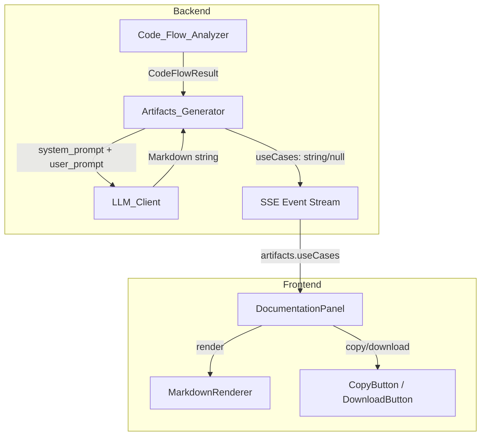

# Design: Generación de Casos de Uso

## Overview

Esta funcionalidad añade la generación automática de Historias de Usuario y Casos de Uso al pipeline de análisis de DevGhost Parser. A partir de los nodos de tipo Controller y Route (con sus métodos detectados) del análisis Code Flow, el sistema construye un prompt especializado para el LLM que produce un documento Markdown combinado con dos secciones: historias de usuario en formato "Como [rol], quiero [acción], para [beneficio]" y casos de uso formales estilo UML con actores, precondiciones, postcondiciones, flujo principal y flujos alternativos.

El diseño sigue el patrón existente de los otros artefactos (`generate_c4_diagram`, `generate_adr`, etc.): un nuevo método `generate_use_cases` en `Artifacts_Generator` que extrae datos relevantes del `CodeFlowResult`, construye prompts en español, invoca `LLM_Client.complete()`, y retorna el resultado o `None`. En el frontend, se agrega una pestaña "Casos de Uso" al `DocumentationPanel` con rendering Markdown.

## Architecture



**Flujo de datos:**
1. `Code_Flow_Analyzer` produce `CodeFlowResult` con nodos tipados y sus métodos.
2. `Artifacts_Generator.generate_use_cases(code_flow)` filtra nodos Controller/Route, extrae métodos y relaciones con Services/Middleware via edges.
3. Se construyen `system_prompt` (instrucciones de formato y estructura) y `user_prompt` (datos del código) y se invoca `LLM_Client.complete()`.
4. El resultado se incluye en el dict de artefactos bajo la clave `useCases` durante la emisión SSE.
5. El frontend recibe `artifacts.useCases` y lo muestra en la pestaña dedicada con `MarkdownRenderer`.

## Components and Interfaces

### Backend

#### `Artifacts_Generator.generate_use_cases(code_flow: CodeFlowResult) -> str | None`

Nuevo método público que sigue la convención de los métodos existentes:

```python
def generate_use_cases(self, code_flow: "CodeFlowResult | None") -> str | None:
    """Generate User Stories and Use Cases from Controller/Route methods."""
    if not self._llm_client or not self._llm_client.available:
        return None
    if not code_flow or not code_flow.nodes:
        return None
    
    # Filtrar nodos relevantes
    controllers = [n for n in code_flow.nodes if n.type in ("Controller", "Route")]
    if not controllers:
        return None
    
    # Extraer contexto (middleware, services) via edges
    user_prompt = self._build_use_case_prompt(code_flow, controllers)
    system_prompt = self._build_use_case_system_prompt()
    
    result = self._llm_client.complete(system_prompt, user_prompt)
    return result if result and result.strip() else None
```

#### `Artifacts_Generator._build_use_case_prompt(code_flow, controllers) -> str`

Método privado que construye el `user_prompt` con:
- Lista de controladores y sus métodos
- Servicios asociados (via edges de tipo `calls` o `depends_on`)
- Middleware asociado (via edges)
- Información contextual sobre el tipo de cada controlador

```python
def _build_use_case_prompt(
    self, code_flow: "CodeFlowResult", controllers: list["Node"]
) -> str:
    # Mapear edges para encontrar dependencias
    node_map = {n.id: n for n in code_flow.nodes}
    edges_from = {}
    for edge in code_flow.edges:
        edges_from.setdefault(edge.source, []).append(edge)
    
    lines = []
    for ctrl in controllers:
        methods = ctrl.method_names[:15] if ctrl.method_names else []
        if not methods:
            continue
        lines.append(f"\n### {ctrl.label} (tipo: {ctrl.type})")
        lines.append(f"Descripción: {ctrl.description}")
        lines.append(f"Métodos: {', '.join(methods)}")
        
        # Servicios y middleware relacionados
        related = edges_from.get(ctrl.id, [])
        services = [node_map[e.target].label for e in related 
                   if e.target in node_map and node_map[e.target].type == "Service"]
        middleware = [node_map[e.target].label for e in related 
                    if e.target in node_map and node_map[e.target].type == "Middleware"]
        
        if services:
            lines.append(f"Servicios invocados: {', '.join(services)}")
        if middleware:
            lines.append(f"Middleware asociado: {', '.join(middleware)}")
    
    return "\n".join(lines)
```

#### `Artifacts_Generator._build_use_case_system_prompt() -> str`

Prompt del sistema que instruye al LLM sobre el formato esperado:

```python
def _build_use_case_system_prompt(self) -> str:
    return (
        "Eres un analista de software experto. A partir de los controladores y métodos "
        "proporcionados, genera un documento Markdown con dos secciones:\n\n"
        "## Historias de Usuario\n"
        "Para cada método público de cada controlador, genera una historia de usuario en formato:\n"
        "### HU-XXX: [título breve]\n"
        "**Como** [rol derivado del contexto del controlador], "
        "**quiero** [acción derivada del nombre del método], "
        "**para** [beneficio derivado de la lógica de negocio].\n\n"
        "Reglas para historias:\n"
        "- El rol debe derivarse del contexto (auth → administrador, public → usuario, etc.)\n"
        "- La acción debe ser específica al método, no genérica\n"
        "- El beneficio debe ser concreto y relevante\n"
        "- Idioma: español\n\n"
        "## Casos de Uso\n"
        "Agrupa historias de usuario relacionadas por controlador o dominio. "
        "Para cada caso de uso incluye:\n"
        "### CU-XXX: [nombre del caso de uso]\n"
        "**Actores:** [lista de actores]\n"
        "**Historias relacionadas:** [HU-XXX, HU-YYY]\n"
        "**Precondiciones:**\n- [incluir validaciones de middleware si aplica]\n"
        "**Postcondiciones:**\n- [resultado esperado]\n"
        "**Flujo Principal:**\n1. [paso]\n2. [paso]... (entre 3 y 10 pasos)\n"
        "**Flujos Alternativos:**\n- [FA1]: [descripción del flujo alternativo]\n\n"
        "Reglas para casos de uso:\n"
        "- Incluir middleware como precondiciones\n"
        "- Incluir llamadas a servicios como pasos del flujo principal\n"
        "- Identificar flujos alternativos (validaciones, errores)\n"
        "- Cada caso debe referenciar las historias de usuario que agrupa\n"
        "- Idioma: español\n"
        "- Responde SOLO con el Markdown, sin bloques de código\n"
    )
```

### Frontend

#### Tipo `ArtifactTab` extendido

```typescript
type ArtifactTab = 'c4' | 'dictionary' | 'adr' | 'rbac' | 'testing' | 'usecases';
```

#### Interface `ArtifactsResponse` extendida

```typescript
export interface ArtifactsResponse {
  c4Mermaid: string | null;
  dbDictionary: string | null;
  adrDocument: string | null;
  rbacMatrix: string | null;
  testPlan: string | null;
  useCases: string | null;
}
```

#### Pestaña en `DocumentationPanel`

Se agrega una entrada al array `tabs`:
```typescript
{ id: 'usecases', label: 'Casos de Uso', icon: '👤' }
```

Y se extiende `getContent` para manejar el nuevo tab:
```typescript
if (tab === 'usecases') return artifacts.useCases || FALLBACK_USECASES;
```

### Pipeline Integration (server.py)

En el bloque `asyncio.to_thread` donde se generan artefactos, se añade la llamada:

```python
artifacts_result = await asyncio.to_thread(lambda: {
    "c4Mermaid": generator.generate_c4_diagram(_cf, _er),
    "dbDictionary": generator.generate_db_dictionary(_er),
    "adrDocument": generator.generate_adr(_cf, _er),
    "rbacMatrix": generator.generate_rbac_matrix(_cf),
    "testPlan": generator.generate_test_plan(_cf, tmp_dir),
    "useCases": generator.generate_use_cases(_cf),  # NUEVO
})
```

## Data Models

### Entrada (existente, sin modificar)

```python
@dataclass
class Node:
    id: str
    label: str
    type: NodeType  # "Controller" | "Service" | "Route" | "Middleware" | ...
    description: str = ""
    method_names: list[str] = field(default_factory=list)

@dataclass
class Edge:
    source: str
    target: str
    relation: EdgeRelation  # "imports" | "calls" | "depends_on"

@dataclass
class CodeFlowResult:
    nodes: list[Node] = field(default_factory=list)
    edges: list[Edge] = field(default_factory=list)
    errors: list[AnalysisError] = field(default_factory=list)
```

### Salida

El método `generate_use_cases` retorna `str | None`:
- `str`: Documento Markdown completo con secciones "Historias de Usuario" y "Casos de Uso"
- `None`: Cuando el LLM no está disponible, no hay controladores/rutas, o el LLM retorna vacío

### Estructura del Documento Markdown Generado

```markdown
## Historias de Usuario

### HU-001: [título]
**Como** [rol], **quiero** [acción], **para** [beneficio].

### HU-002: [título]
...

## Casos de Uso

### CU-001: [nombre]
**Actores:** [lista]
**Historias relacionadas:** HU-001, HU-002
**Precondiciones:**
- [precondición 1]
**Postcondiciones:**
- [postcondición 1]
**Flujo Principal:**
1. [paso 1]
2. [paso 2]
...
**Flujos Alternativos:**
- FA1: [descripción]
```

### Respuesta API (extendida)

```typescript
// artifacts field in SSE analysis_complete event
{
  "c4Mermaid": "...",
  "dbDictionary": "...",
  "adrDocument": "...",
  "rbacMatrix": "...",
  "testPlan": "...",
  "useCases": "..." | null  // NUEVO
}
```

## Correctness Properties

*A property is a characteristic or behavior that should hold true across all valid executions of a system — essentially, a formal statement about what the system should do. Properties serve as the bridge between human-readable specifications and machine-verifiable correctness guarantees.*

### Property 1: Prompt completeness — methods, services, and middleware included

*For any* valid `CodeFlowResult` containing Controller/Route nodes with methods, and edges connecting them to Service and Middleware nodes, the generated `user_prompt` string SHALL contain every method name from those controllers, every label of connected Service nodes, and every label of connected Middleware nodes.

**Validates: Requirements 1.1, 2.3, 2.4, 6.5**

### Property 2: Controllers without methods are excluded from prompt

*For any* `CodeFlowResult` containing a mix of Controller/Route nodes where some have empty `method_names` lists, the generated `user_prompt` string SHALL NOT contain the labels of controllers that have zero methods.

**Validates: Requirements 1.5**

### Property 3: Guard clause — returns None when preconditions unmet

*For any* `CodeFlowResult` that contains zero nodes of type Controller or Route, OR when the `LLM_Client.available` property is False, `generate_use_cases` SHALL return `None` without invoking the LLM.

**Validates: Requirements 3.3, 4.3**

### Property 4: Empty LLM response produces None

*For any* valid `CodeFlowResult` with Controller/Route nodes and methods, if `LLM_Client.complete()` returns an empty string, a whitespace-only string, or `None`, then `generate_use_cases` SHALL return `None`.

**Validates: Requirements 6.4**

## Error Handling

| Scenario | Behavior | Return Value |
|----------|----------|--------------|
| `LLM_Client` is `None` | Early return | `None` |
| `LLM_Client.available` is `False` | Early return | `None` |
| `code_flow` is `None` | Early return | `None` |
| `code_flow.nodes` is empty | Early return | `None` |
| No Controller/Route nodes in code_flow | Early return | `None` |
| All Controller/Route nodes have empty methods | Early return (no prompt content) | `None` |
| `LLM_Client.complete()` returns `None` | Return None | `None` |
| `LLM_Client.complete()` returns empty/whitespace | Strip and check, return None | `None` |
| `LLM_Client.complete()` raises exception | Caught internally by LLM_Client (returns None) | `None` |
| Edge references non-existent node ID | Skip that edge in prompt building | Graceful degradation |

**Design Decision:** The method follows the same defensive pattern as all existing artifact generators — any failure condition produces `None` rather than raising exceptions. The frontend handles `null` by showing a fallback message.

## Testing Strategy

### Property-Based Tests (Hypothesis — Python)

La librería **Hypothesis** ya está presente en el proyecto (hay una carpeta `.hypothesis/` en backend). Se usará para los property tests del prompt builder.

Cada property test ejecutará un mínimo de **100 iteraciones** con datos generados aleatoriamente.

**Generadores necesarios:**
- `st_node()`: Genera un `Node` con tipo aleatorio, label aleatorio, y 0-15 method_names aleatorios
- `st_code_flow_result()`: Genera un `CodeFlowResult` con nodos de tipos variados y edges válidos entre ellos
- `st_code_flow_with_controllers()`: Variante que garantiza al menos un Controller/Route con métodos

**Tests de propiedad:**

| Property | Test | Tag |
|----------|------|-----|
| 1 | Generar CodeFlowResult aleatorio con controllers+edges. Verificar prompt contiene todos los métodos, servicios y middleware | Feature: use-case-generation, Property 1: Prompt completeness |
| 2 | Generar CodeFlowResult con mezcla de controllers con/sin métodos. Verificar labels sin métodos ausentes del prompt | Feature: use-case-generation, Property 2: Empty controllers excluded |
| 3 | Generar CodeFlowResult sin Controller/Route. Verificar retorno None. También probar con LLM unavailable | Feature: use-case-generation, Property 3: Guard clause returns None |
| 4 | Generar CodeFlowResult válido. Mock LLM retorna "", " ", None. Verificar retorno None | Feature: use-case-generation, Property 4: Empty LLM response produces None |

### Unit Tests (pytest)

- Verificar que el `system_prompt` contiene instrucciones clave: "español", "Como [rol]", "Precondiciones", "Flujo Principal", "entre 3 y 10 pasos"
- Verificar que `generate_use_cases` invoca `LLM_Client.complete()` con los prompts construidos (mock)
- Verificar integración con el dict de artifacts (clave `useCases` presente)

### Frontend Tests (ejemplo-based)

- Verificar que `ArtifactTab` incluye `'usecases'`
- Verificar que la pestaña "Casos de Uso" se renderiza cuando `artifacts.useCases` tiene contenido
- Verificar que se muestra el fallback cuando `artifacts.useCases` es null
- Verificar que Copy/Download funcionan con el contenido de useCases

